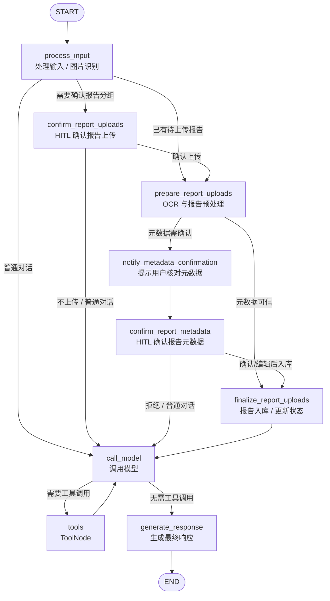
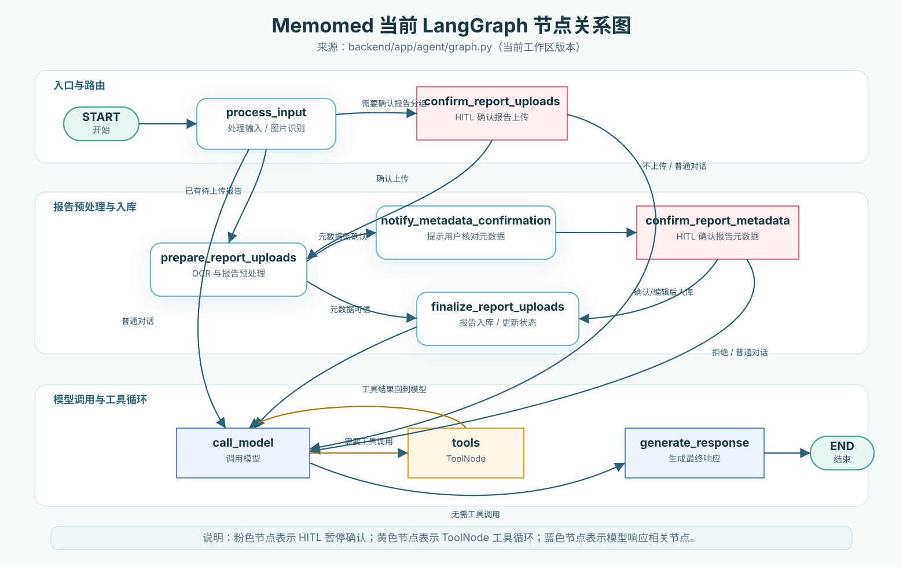

# Memomed 当前 LangGraph 流程图

来源：`backend/app/agent/graph.py` 当前工作区版本。

```mermaid
flowchart TD
    START([START]) --> process_input["process_input<br/>处理输入 / 图片识别"]

    process_input -->|"需要确认报告分组"| confirm_report_uploads["confirm_report_uploads<br/>HITL 确认报告上传"]
    process_input -->|"已有待上传报告"| prepare_report_uploads["prepare_report_uploads<br/>OCR 与报告预处理"]
    process_input -->|"普通对话"| call_model["call_model<br/>调用模型"]

    confirm_report_uploads -->|"确认上传"| prepare_report_uploads
    confirm_report_uploads -->|"不上传 / 普通对话"| call_model

    prepare_report_uploads -->|"元数据需确认"| notify_metadata_confirmation["notify_metadata_confirmation<br/>提示用户核对元数据"]
    prepare_report_uploads -->|"元数据可信"| finalize_report_uploads["finalize_report_uploads<br/>报告入库 / 更新状态"]

    notify_metadata_confirmation --> confirm_report_metadata["confirm_report_metadata<br/>HITL 确认报告元数据"]

    confirm_report_metadata -->|"确认/编辑后入库"| finalize_report_uploads
    confirm_report_metadata -->|"拒绝 / 普通对话"| call_model

    finalize_report_uploads --> call_model

    call_model -->|"需要工具调用"| tools["tools<br/>ToolNode"]
    call_model -->|"无需工具调用"| generate_response["generate_response<br/>生成最终响应"]

    tools --> call_model
    generate_response --> END([END])
```

## 图片版本

