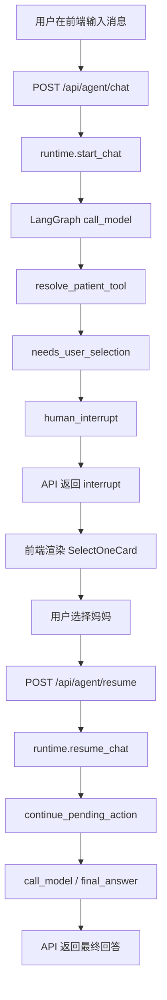

# Memomed Agent V1 干净重写设计

日期：2026-05-13

## 背景

Memomed 第一版要先跑通一个类似 Codex 的 Agent 聊天体验：

- 用户可以在聊天中提出健康管理需求。
- Agent 可以展示过程，而不是只给最终答案。
- Agent 遇到不确定或高风险动作时，可以暂停并让用户选择、确认或补充信息。
- 用户确认后，Runtime 能强制续接原动作，而不是把确认结果完全交给 LLM 自由发挥。

当前 `backend/app/agent/` 已有较多报告上传、RAG、元数据确认逻辑。为了避免新 V1 被旧实现牵引，本次不在旧代码上继续修补，而是把旧实现整体备份，再在正式 `app/agent/` 目录下重写。

## 目标

第一阶段只实现一个最小可测闭环：

```text
用户输入：“帮家人存一下这个报告”
→ Agent 判断需要先确认健康档案对象
→ 返回 select_one interrupt
→ 前端展示选择题：妈妈 / 爸爸 / 我自己 / 新建人物
→ 用户选择“妈妈”
→ 后端强制执行 commit_patient_selection
→ Agent 返回最终回答
```

这个闭环跑通后，再扩展报告上传、OCR、报告入库、用药提醒和 RAG。

## 非目标

第一阶段暂时不做：

- 不做真实 OCR。
- 不做报告入库。
- 不做 RAG。
- 不做用药提醒。
- 不做多 Agent。
- 不做家庭成员完整 CRUD。
- 不兼容旧 `app/agent/` 内部实现。

第一阶段只验证 Agent Harness 和自定义前端 interrupt 交互。

## 目录策略

旧代码整体移动到备份目录：

```text
backend/
  app/
    agent_legacy_backup/
      README.md
      graph.py
      utils/
      ...
```

备份目录只作为参考，不被运行时代码 import，不参与测试主链路。

正式入口仍保留为：

```text
backend/app/agent/
```

原因：

- `langgraph.json` 和已有后端调用入口可以继续指向 `app.agent.graph:graph`。
- 新 Agent 是正式实现，不需要 `memomed_v1` 这种临时命名。
- 旧代码仍可查阅，后续可逐步迁移 OCR、RAG、报告处理能力。

## 后端结构

```text
backend/
  app/
    agent/
      __init__.py
      graph.py
      state.py
      runtime.py
      prompts.py

      tools/
        __init__.py
        registry.py
        schemas.py
        patient.py

      hitl/
        __init__.py
        schemas.py
        router.py

      api/
        __init__.py
        routes.py
        schemas.py
```

### `graph.py`

定义 LangGraph 主循环。

核心节点：

- `call_model`：调用 LLM，让模型决定是否调用工具。
- `tool_node`：执行工具。
- `inspect_tool_result`：读取工具结构化结果。
- `human_interrupt`：触发 LangGraph `interrupt()`。
- `continue_pending_action`：用户确认后强制续接。
- `final_answer`：输出最终回答。

### `state.py`

定义 Agent 状态。

第一版字段：

```python
class AgentState(TypedDict):
    messages: Annotated[list, operator.add]
    process_events: Annotated[list[dict], operator.add]
    pending_action: dict | None
    interaction: dict | None
    user_decision: dict | None
    response: str | None
    metadata: dict
```

`process_events` 用来支持前端展示“我正在判断归属人”“我需要你确认”等过程信息。

### `runtime.py`

封装 LangGraph 的调用细节，给 API 层使用。

建议对外提供：

```python
async def start_chat(message: UserMessageInput) -> AgentRunResult
async def resume_chat(thread_id: str, decision: UserDecisionInput) -> AgentRunResult
```

API 层不直接理解 LangGraph 的 `Command(resume=...)`，统一由 runtime 封装。

### `tools/schemas.py`

定义工具统一返回协议。

```text
success
needs_user_confirmation
needs_user_selection
needs_user_input
error
```

`needs_user_confirmation` 和 `needs_user_selection` 必须带：

```text
pending_action.id
pending_action.type
pending_action.continuation_tool
pending_action.candidate_payload
interaction
```

`needs_user_input` 可以没有 `pending_action`。

### `tools/patient.py`

第一版只实现人物确认相关能力：

- `resolve_patient_tool`
- `commit_patient_selection`

`resolve_patient_tool` 是 LLM 可调用 tool。

`commit_patient_selection` 第一版建议作为 runtime continuation handler，不作为 LLM 自由选择的 tool。

这样可以验证“用户确认后强制续接”。

### `tools/registry.py`

集中注册 tool 和 continuation handler。

第一版包含：

```python
TOOLS = [resolve_patient_tool]

CONTINUATION_HANDLERS = {
    "commit_patient_selection": commit_patient_selection,
}
```

后续扩展报告、用药、RAG 时，都从这里注册。

### `hitl/router.py`

负责把 tool result 转为 graph 路由。

规则：

```text
status == success
  → 回到 call_model

status == needs_user_confirmation / needs_user_selection / needs_user_input
  → human_interrupt

用户 resume 后：
  如果存在 pending_action.id
    → continue_pending_action
  否则
    → call_model
```

## 后端 API

第一版提供两个接口：

```text
POST /api/agent/chat
POST /api/agent/resume
```

### `POST /api/agent/chat`

请求：

```json
{
  "thread_id": "optional-thread-id",
  "message": "帮家人存一下这个报告"
}
```

响应：

```json
{
  "thread_id": "thread-001",
  "messages": [],
  "process_events": [
    {
      "type": "thinking",
      "text": "我需要先确认这次要管理谁的健康档案。"
    }
  ],
  "interrupt": {
    "type": "select_one",
    "title": "这次要管理谁的健康档案？",
    "options": [
      {"label": "妈妈", "value": "mother"},
      {"label": "爸爸", "value": "father"},
      {"label": "我自己", "value": "self"},
      {"label": "新建人物", "value": "create_patient"}
    ],
    "pending_action": {
      "id": "pa_001",
      "type": "confirm_patient",
      "continuation_tool": "commit_patient_selection"
    }
  },
  "status": "interrupted"
}
```

### `POST /api/agent/resume`

请求：

```json
{
  "thread_id": "thread-001",
  "decision": {
    "value": "mother",
    "label": "妈妈"
  }
}
```

响应：

```json
{
  "thread_id": "thread-001",
  "messages": [
    {
      "role": "assistant",
      "content": "已确认这次管理对象是妈妈。下一步我可以继续帮你分析报告，并在入库前再次让你确认。"
    }
  ],
  "process_events": [
    {
      "type": "tool_result",
      "text": "用户已确认健康档案对象：妈妈。"
    }
  ],
  "interrupt": null,
  "status": "completed"
}
```

## 前端结构

不复用旧 Next.js agent UI。旧 `frontend/` 整体移动到备份目录：

```text
frontend_legacy_backup/
```

然后重新创建 `frontend/`，使用普通 React + Vite + TypeScript 实现一个自定义测试页面。

原因：

- 第一版重点是验证 Agent Harness，不需要 SSR、App Router、服务端组件或 Next API Routes。
- 前端只是 Agent Runtime 的 interaction renderer，直接调用 FastAPI 更清晰。
- Vite 结构轻，适合快速测试聊天状态、过程事件、interrupt 和 resume。

```text
frontend/
  package.json
  vite.config.ts
  index.html
  src/
    main.tsx
    App.tsx

    components/
      agent/
        ChatTimeline.tsx
        ProcessEventCard.tsx
        InterruptCard.tsx
        SelectOneCard.tsx
        ConfirmCard.tsx
        TextInputCard.tsx
        Composer.tsx

    api/
      memomedAgentClient.ts

    types/
      agent.ts
```

### 页面形态

页面分为三块：

- 顶部：产品标题和当前 thread 状态。
- 中间：聊天消息 + process events + interrupt card。
- 底部：输入框和发送按钮。

第一版不追求复杂视觉，但要能明确看到：

- 用户发了什么。
- Agent 正在做什么。
- Agent 为什么暂停。
- 用户可选什么。
- 用户选择后最终结果是什么。

### `InterruptCard`

统一根据 `interaction.type` 分发：

```text
select_one → SelectOneCard
confirm → ConfirmCard
text_input → TextInputCard
```

第一版必须实现 `select_one`。

`confirm` 和 `text_input` 可以先保留组件壳，后续扩展。

## 数据流



## 错误处理

第一版只处理最小错误：

- LLM 调用失败：返回 `status = error`，前端展示错误消息。
- resume 时 thread 不存在：返回 404 或业务错误。
- resume payload 不合法：返回 400。
- continuation_tool 未注册：返回 `status = error`，不让 LLM 自行猜测。

## 测试策略

后端测试：

- `resolve_patient_tool` 对明确人物返回 `success`。
- `resolve_patient_tool` 对“家人”返回 `needs_user_selection`。
- graph 首次调用返回 interrupt。
- resume 后强制调用 `commit_patient_selection`。
- 未注册 continuation_tool 返回错误。

前端测试：

- 输入消息后能展示 process event。
- 收到 `select_one` interrupt 后展示四个选项。
- 点击“妈妈”后调用 `/api/agent/resume`。
- resume 完成后展示最终回答并清空 interrupt。

## 验收标准

第一版完成后，手动测试应能完成：

1. 打开自定义前端页面。
2. 输入“帮家人存一下这个报告”。
3. 页面显示 Agent 过程卡片。
4. 页面弹出选择题。
5. 选择“妈妈”。
6. 页面显示最终回答。
7. 后端日志或测试能证明用户选择后走的是 `commit_patient_selection`，不是 LLM 自由猜测。

## 后续扩展顺序

第一版跑通后，按以下顺序扩展：

```text
人物选择
→ 上传文件/图片入口
→ OCR mock
→ OCR 文本编辑确认
→ 报告入库确认
→ 用药提醒确认
→ 报告检索/RAG
→ Review Inbox
```

每一步都复用同一套 tool result contract 和 interrupt renderer。
