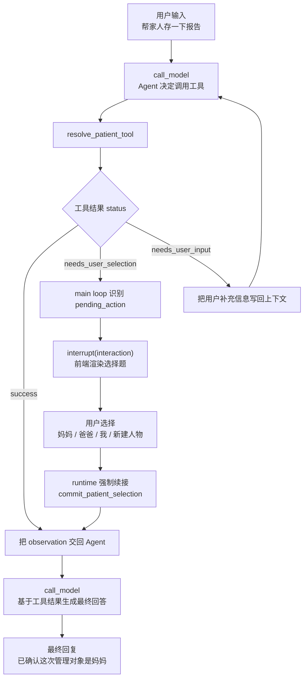
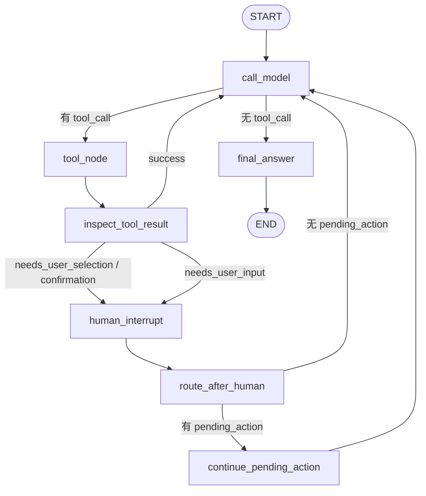

# Memomed 最小 Agent Loop + HITL 技术方案

日期：2026-05-13

## 目标

先不做完整报告入库、用药提醒、复杂 RAG，也不改动原来的企业级 spec。

本方案只跑通一个最小闭环，并作为 Memomed 后续所有“需要用户参与”的交互底座：

```text
用户发起聊天
→ Agent 调用一个工具
→ 工具返回 needs_user_selection
→ 主循环触发 human interrupt
→ 用户选择一个选项
→ runtime 强制续接 pending action
→ 得到最终结果
→ Agent 给出最终回答
```

这个闭环跑通后，后续报告归属确认、用药提醒确认、OCR 编辑确认，都可以复用同一套模式。

第一版的重点不是医疗能力本身，而是先证明这套 Agent Harness 可以稳定处理：

- Agent 主动展示过程。
- Tool 返回结构化交互请求。
- Runtime 暂停并等待用户。
- 用户确认后，Runtime 能强制续接原动作。
- 最终回答能解释“我做了什么、基于什么结果继续”。

## 核心概念

### Tool 返回结构化结果

工具不直接“弹窗”，也不直接操作前端。工具只返回结构化结果。

换句话说，Tool 不应该知道“前端按钮长什么样”。Tool 只描述：

- 现在是否完成。
- 是否需要用户确认、选择或补充信息。
- 如果用户确认了，应该续接哪个动作。
- 前端需要渲染什么样的交互卡片。

Tool result contract 统一为五类：

```text
success
needs_user_confirmation
needs_user_selection
needs_user_input
error
```

### success

表示工具已完成。

```python
{
    "status": "success",
    "message": "已完成"
}
```

### needs_user_confirmation / needs_user_selection

表示需要用户确认/选择一个已经提出的待执行动作。它们必须携带 `pending_action`。

```python
{
    "status": "needs_user_selection",
    "pending_action": {
        "id": "pa_001",
        "type": "confirm_patient",
        "continuation_tool": "commit_patient_selection",
        "candidate_payload": {
            "original_text": "帮妈妈存一下报告"
        }
    },
    "interaction": {
        "type": "select_one",
        "title": "这次要管理谁的健康档案？",
        "options": [
            {"label": "妈妈", "value": "mother"},
            {"label": "爸爸", "value": "father"},
            {"label": "我自己", "value": "self"},
            {"label": "新建人物", "value": "create_patient"}
        ]
    }
}
```

这里的关键是：`pending_action` 代表 Agent 已经提出了一个明确动作，只差用户批准或选择。

因此用户回复后，不应该完全交给 LLM 自由判断下一步，而应该由 Runtime 强制执行 `continuation_tool`。

### needs_user_input

表示需要用户补充开放信息，不一定有固定续接动作。

```python
{
    "status": "needs_user_input",
    "interaction": {
        "type": "text_input",
        "title": "你想查询哪段时间的报告？",
        "placeholder": "例如：最近半年"
    },
    "context_key": "report_time_range"
}
```

这里的关键是：`needs_user_input` 更像澄清问题。用户回答后，通常回到 LLM loop，由模型重新判断下一步。

### error

表示工具执行失败。

```python
{
    "status": "error",
    "message": "没有找到可用的报告文件"
}
```

## 主循环负责 interrupt

主循环检测到：

```text
status in {"needs_user_confirmation", "needs_user_selection", "needs_user_input"}
```

就触发 LangGraph `interrupt(interaction)`。

前端根据 `interaction.type` 渲染选择题、确认卡片或编辑表单。

## 用户回复后如何继续

### 有 pending_action：强制续接

确认类和选择类交互，用户完成后不把选择结果单纯丢给 LLM 自由发挥。

只要 tool result 里有：

```text
pending_action.id
pending_action.continuation_tool
```

runtime 就根据 pending action 强制调用续接函数。

```text
pending_action + user_decision
→ commit_patient_selection(...)
→ 得到 success observation
→ 回到 Agent Loop
```

这样可以保证确认动作不会跑偏。

### 没有 pending_action：回到 LLM loop

开放式补充信息不同。如果 tool result 没有 `pending_action`，用户回答后作为新上下文回到 LLM loop，让 Agent 自己决定下一步。

```text
user_input
→ 写入 messages/context
→ 回到 call_model
→ LLM 决定下一步 tool
```

## 最小版本只做什么

第一版只实现一个工具：

```text
resolve_patient_tool
```

它的职责：

1. 读取用户输入。
2. 尝试判断用户说的是妈妈、爸爸、我自己，还是无法判断。
3. 为了测试 HITL，第一版可以故意对“帮家人存一下报告”这类输入返回 `needs_user_selection`。
4. 返回一个 `select_one` interaction。

用户选择后，调用续接逻辑：

```text
commit_patient_selection
```

它的职责：

1. 合并 pending action 和用户选择。
2. 返回最终确认结果。
3. 暂时不写数据库，只返回 mock 结果。

## 最小流程图



## LangGraph 最小图



## 节点职责

### call_model

职责：

- 调用 LLM。
- 绑定工具。
- 让模型决定是否调用 `resolve_patient_tool`。

第一版可以用强提示词：

```text
如果用户表达中出现“妈妈 / 爸爸 / 我 / 家人 / 报告 / 存一下”，优先调用 resolve_patient_tool。
```

### tool_node

职责：

- 执行工具。
- 得到结构化 tool result。

### inspect_tool_result

职责：

- 读取最近一次 tool result。
- 如果 `status == needs_user_confirmation` 或 `needs_user_selection`，把 `pending_action` 存入 state。
- 如果 `status == needs_user_input`，不需要 pending action，只保存 interaction。
- 路由到 `human_interrupt` 或回到 `call_model`。

### human_interrupt

职责：

- 调用 LangGraph `interrupt(interaction)`。
- 等待用户选择或输入。
- 返回 `user_decision`。

### route_after_human

职责：

- 如果 state 中有 `pending_action`，路由到 `continue_pending_action`。
- 如果没有 `pending_action`，把用户回复作为上下文回到 `call_model`。

### continue_pending_action

职责：

- 读取 state 中保存的 `pending_action`。
- 读取用户选择。
- 根据 `continuation_tool` 强制调用对应续接逻辑。
- 把续接结果作为 observation 放回 messages。

第一版只支持：

```text
continuation_tool == commit_patient_selection
```

这个续接逻辑可以先不是一个 LLM tool，而是 Runtime 内部注册的 continuation handler。

原因是第一版我们更想验证“强制续接”这件事本身，而不是让模型再决定一次。

### final_answer

职责：

- 将最终 AIMessage 内容写入 `response`。
- 写入 `metadata.status = completed`。

## State 最小字段

```python
class AgentState(TypedDict):
    messages: Annotated[list, operator.add]
    pending_action: dict | None
    interaction: dict | None
    user_decision: dict | None
    response: str
    metadata: dict
```

如果暂时不想新建 state，可以在现有 `AgentState` 里追加：

```python
pending_action: dict
interaction: dict
user_decision: dict
```

## 工具结果约定

### 成功结果

```python
{
    "status": "success",
    "message": "已确认这次管理对象是妈妈",
    "patient": {
        "patient_code": "mother",
        "display_name": "妈妈"
    }
}
```

### 需要用户选择

```python
{
    "status": "needs_user_selection",
    "pending_action": {
        "id": "pa_001",
        "type": "confirm_patient",
        "continuation_tool": "commit_patient_selection",
        "candidate_payload": {
            "source": "resolve_patient_tool"
        }
    },
    "interaction": {
        "type": "select_one",
        "title": "这次要管理谁的健康档案？",
        "options": [
            {"label": "妈妈", "value": "mother"},
            {"label": "爸爸", "value": "father"},
            {"label": "我自己", "value": "self"},
            {"label": "新建人物", "value": "create_patient"}
        ]
    }
}
```

### 需要用户补充信息

```python
{
    "status": "needs_user_input",
    "interaction": {
        "type": "text_input",
        "title": "你想查询哪段时间的报告？",
        "placeholder": "例如：最近半年"
    },
    "context_key": "report_time_range"
}
```

## Memomed 落地规则

`needs_user_confirmation / needs_user_selection` 必须包含：

```text
pending_action.id
pending_action.type
pending_action.continuation_tool
pending_action.candidate_payload
interaction
```

`needs_user_input` 可以只包含：

```text
interaction
context_key
```

运行时规则：

```text
如果存在 pending_action.id：
  用户回复后强制执行 continuation_tool

如果不存在 pending_action.id：
  用户回复作为新消息或上下文回到 LLM loop
```

典型场景：

```text
needs_user_confirmation：
“是否把这份报告入库？”

needs_user_selection：
“这份报告属于妈妈、爸爸、我，还是新建人物？”

needs_user_input：
“你想查最近多久的报告？”
```

这套规则与 Codex/OpenClaw 的 approval 思路一致：当 Agent 已经提出一个明确动作时，用户批准后执行原动作；当 Agent 只是向用户澄清信息时，用户回复回到模型循环。

## Memomed 第一版落地建议

### 第一版只做一个可见能力

先做“聊天中识别健康档案对象”。

用户输入：

```text
帮家人存一下这个报告
```

Agent 过程：

```text
我需要先确认这份报告属于谁，然后再继续处理。
```

前端展示选择：

```text
这次要管理谁的健康档案？

- 妈妈
- 爸爸
- 我自己
- 新建人物
```

用户选择“妈妈”后，Runtime 强制执行：

```text
commit_patient_selection(pending_action, user_decision)
```

最终回答：

```text
已确认这次管理对象是妈妈。下一步我可以继续帮你分析上传的报告，并在入库前再次让你确认。
```

这一版不做 OCR、不写数据库、不做报告解析。先把“Agent 像 Codex 一样暂停、询问、续接”的产品形态跑通。

### 第一版代码改造范围

建议只动最小闭环相关代码：

- 在 `AgentState` 里增加 `pending_action`、`interaction`、`user_decision`。
- 增加一个 `resolve_patient_tool`，只负责返回 `success` 或 `needs_user_selection`。
- 增加一个 Runtime continuation handler：`commit_patient_selection`。
- 在 LangGraph 里增加 `inspect_tool_result`、`human_interrupt`、`continue_pending_action` 三个节点。
- 前端如果暂时没有专门的选择题 UI，可以先复用现有 interrupt 展示，后面再做漂亮卡片。

### 第一版不要做什么

为了防止第一版扩散，暂时不要做：

- 不做真实报告入库。
- 不做复杂人物画像和家庭成员管理。
- 不做长期 memory。
- 不做 RAG。
- 不做 medication reminder。
- 不做多 agent。
- 不把所有老逻辑强行迁移进来。

我们先把“一个工具 + 一个 interrupt + 一个强制续接”打透。

### 与未来完整产品的关系

这个最小闭环不是临时代码，而是未来 Memomed 的交互协议雏形。

后续所有高风险或需要用户确认的动作，都可以按同一套协议返回：

```text
needs_user_confirmation
needs_user_selection
needs_user_input
```

例如：

- 报告归属不确定：`needs_user_selection`。
- OCR 识别结果要用户编辑：`needs_user_input` 或 `needs_user_confirmation`。
- 报告准备入库：`needs_user_confirmation`。
- 检测到用药建议：`needs_user_confirmation`。
- 问健康问题时查询到多份相关报告：`success`，并在最终回答中附 sources。

### 技术选型建议

第一版继续用 LangGraph，不急着上 Deep Agents 或多 agent 框架。

理由：

- 我们现在要验证的是 Harness 行为：暂停、恢复、续接、状态保存。
- LangGraph 的 `interrupt()` / `Command(resume=...)` 正好覆盖这个能力。
- Tool Registry、RAG、Memory、Subagent 都可以后续加，不需要第一版就铺满。

第一版的架构可以理解为：

```text
LangGraph = Agent loop / 状态机 / HITL runtime
Tool = 可被 Agent 调用的业务能力
Continuation handler = 用户确认后的确定性续接动作
Frontend = interaction renderer
```

### 面试表达方式

如果面试官问“你这个 Agent 怎么做到企业级可控”，可以这样说：

```text
我没有让工具直接控制前端，也没有让用户确认后的动作重新交给模型自由发挥。

我的设计是：工具返回结构化状态。如果是 confirmation 或 selection，会带 pending_action 和 continuation_tool。
Runtime 负责统一 interrupt。用户确认后，如果 pending_action 存在，就强制执行 continuation handler；
如果只是开放式补充信息，就把用户输入回到 LLM loop。

这样可以把 Agent 的自主性和业务动作的确定性分开：模型负责判断意图和选择工具，Runtime 负责安全边界、暂停恢复和可审计的续接。
```

这句话是后面面试里很有价值的核心表达。

## 为什么这样设计

### 不让 tool 直接控制 UI

Tool 只返回结构化 `interaction`，不关心 Web、CLI、移动端怎么展示。

### 不把确认结果完全交给 LLM

确认类动作具有明确续接语义。用户确认后，runtime 应强制执行 pending action，避免模型跑偏。

### 未来可扩展

同一套模式可以扩展到：

- 确认报告归属。
- 确认报告元数据。
- 确认是否入库。
- 确认用药提醒。
- 编辑 OCR 文本。
- 新建家庭成员。

## 第一版验收标准

1. 用户输入一句会触发 `resolve_patient_tool` 的话。
2. 工具返回 `needs_user_selection`。
3. LangGraph interrupt 暂停。
4. 前端能看到一个选择题。
5. 用户选择后，graph resume。
6. runtime 调用 `commit_patient_selection`。
7. 最终回答中包含用户选择的人物。

## 后续扩展

第一版只做人物选择。

跑通后再扩展：

```text
人物选择
→ 报告归属确认
→ 报告元数据编辑
→ 报告入库确认
→ 用药提醒确认
→ Review Inbox
```

核心原则不变：

```text
tool 发现需要人参与
→ 返回 interaction request
→ main loop interrupt
→ 用户选择或输入
→ 如果有 pending_action_id，runtime 强制续接 pending action
→ 如果没有 pending_action_id，用户输入回到 LLM loop
→ agent 继续回答
```
