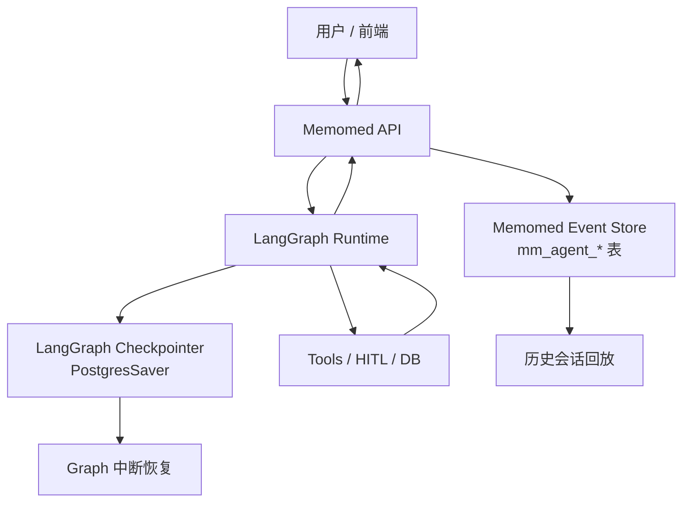

# Memomed Agent Event Protocol 与历史会话技术设计

日期：2026-05-17

## 背景

当前 Memomed 已经跑通了最小 Agent Loop：

```text
用户输入
→ LLM 判断是否调用工具
→ Tool 执行
→ Tool 可能触发 HITL
→ 用户选择/输入后继续
→ LLM 生成最终回复
```

但实际测试中暴露了几个产品级问题：

- 前端过程消息是普通 HTTP 返回后 append，容易把上一轮已有过程重复追加出来。
- Agent 过程和最终回答没有稳定的事件 ID，前端无法准确去重、更新、折叠展示。
- 当前会话没有产品层历史记录模型，刷新页面或重新进入时无法恢复完整聊天时间线。
- LangGraph checkpoint 可以恢复执行状态，但不适合直接作为产品聊天历史的唯一事实源。
- 错误、用户确认、工具结果等中间过程需要像 Codex 一样可见、可折叠、可追踪，而不是只在最终回答里体现。

因此需要定义一套 Memomed 自己的 Agent Event Protocol，把“LangGraph 执行状态”和“用户看到的聊天事件流”分清楚。

## 目标

第一阶段目标：

- 建立标准的 `conversation_id / run_id / event_id / seq` 概念。
- 支持历史会话展示和继续上次会话。
- 支持 Agent 过程折叠展示，过程事件不重复、不丢失、不含糊。
- 支持 HITL interrupt，包括选择题、确认、文本输入、未来的报告 OCR 审核。
- 后端可以从普通 HTTP 过渡到 SSE streaming，不推翻协议。
- LangGraph 使用官方 persistence/checkpointer 负责执行恢复，Memomed 自建事件表负责产品历史。

非目标：

- 第一阶段不做复杂多 Agent 分支会话。
- 第一阶段不把 LangGraph checkpoint 直接暴露给前端。
- 第一阶段不做完整审计系统，但事件模型要为审计预留字段。

## 核心结论

Memomed 第一版建议：

```text
conversation_id == LangGraph thread_id
```

也就是说，一个前端聊天会话对应一个 LangGraph checkpoint thread。

但概念上仍然要区分：

| 概念 | 所属层 | 作用 |
| --- | --- | --- |
| `conversation_id` | Memomed 产品层 | 用户看到的一段聊天会话，用于历史列表、标题、归档、权限控制。 |
| `thread_id` | LangGraph 执行层 | LangGraph checkpoint 命名空间，用于恢复 graph state、HITL interrupt、time travel。 |
| `run_id` | Memomed + LangGraph 调用层 | 一次用户输入或一次 resume 触发的执行过程。 |
| `turn_id` | Memomed 产品层 | 一次用户原始任务，可跨多次 interrupt/resume。 |
| `work_item_id` | Memomed 展示层 | 一个可折叠的 Agent 工作单元，类似 Codex 的 typed item。 |
| `work_item_type` | Memomed 展示层 | 工作单元类型，例如 `subject_resolution`、`report_ingestion`、`evidence_retrieval`。 |
| `event_id` | Memomed 事件层 | 前端去重、更新、折叠展示的稳定事件 ID。 |
| `seq` | Memomed 事件层 | 同一 conversation 内事件顺序，保证重放顺序稳定。 |

当前阶段可以让：

```text
thread_id = conversation_id
```

未来如果一个产品会话里拆出多个独立 graph，例如聊天 graph 和后台报告入库 graph，再引入：

```text
conversation_id = conv_001
thread_id = conv_001_chat
thread_id = conv_001_report_ingestion_001
```

## 为什么不能只依赖 LangGraph Checkpoint

LangGraph checkpoint 的职责是保存 graph state，例如：

- `messages`
- 当前 node
- pending interrupt
- 工具调用结果
- graph 中间状态

它非常适合做：

- 中断恢复。
- 短期上下文记忆。
- time travel 调试。
- 故障后继续执行。

但产品聊天 UI 还需要：

- 会话标题。
- 用户看到的最终消息。
- 可折叠的过程卡片。
- 每个事件的展示状态。
- 错误事件和后续用户输入事件的连续展示。
- 历史列表分页。
- 前端刷新后稳定重放。
- 未来多端同步。

这些不应该强行从 checkpoint 里解析出来。因此建议：

```text
LangGraph Checkpointer = 执行状态事实源
Memomed Event Store = 产品时间线事实源
```

## 总体架构



关键原则：

- 前端只消费 Memomed Event Protocol，不直接消费 LangGraph checkpoint。
- LangGraph 的 `thread_id` 使用 `conversation_id`。
- 每次用户发送消息或完成 interrupt 都创建一个新的 `run_id`。
- `run_id` 是执行边界，`work_item_id` 是本次执行内的 UI 折叠边界。
- 一个 `work_item_id` 默认只属于一个 `run_id`。即使两次 run 都在做“确认健康档案对象”，前端也应该展示为两段独立过程，而不是永久续写同一个折叠块。
- 后端把 LangGraph streaming chunk 转换成 Memomed 标准事件。
- 前端按 `event_id` upsert，按 `seq` 排序，不按纯文本 append。
- 前端在同一 run 内按 `work_item_id` 聚合过程卡片，不跨 run 合并过程卡片。

## 数据模型建议

### `mm_agent_conversations`

产品会话表。

```text
id UUID primary key
owner_user_id varchar(64) not null default 'default'
title varchar(200) nullable
status varchar(20) not null default 'active'
langgraph_thread_id varchar(100) not null
last_event_seq bigint not null default 0
created_at timestamptz not null
updated_at timestamptz not null
archived_at timestamptz nullable
```

字段说明：

| 字段 | 含义 |
| --- | --- |
| `id` | Memomed 产品会话 ID。第一版也作为 LangGraph `thread_id` 使用。 |
| `owner_user_id` | 会话所属用户。第一版固定 `default`，未来支持多账号。 |
| `title` | 会话标题，可由首条用户消息或 LLM 总结生成。 |
| `status` | `active` / `archived`。 |
| `langgraph_thread_id` | 实际传给 LangGraph config 的 `thread_id`。第一版等于 `id`。 |
| `last_event_seq` | 当前会话最后一个事件序号，用于生成下一个 `seq`。 |
| `created_at` | 创建时间。 |
| `updated_at` | 最近更新时间。 |
| `archived_at` | 归档时间。 |

### `mm_agent_runs`

一次执行表。用户发送一条消息、用户点击一个确认按钮、用户输入一个 HITL 文本，都应该生成一个 run。

```text
id UUID primary key
conversation_id UUID not null references mm_agent_conversations(id)
owner_user_id varchar(64) not null default 'default'
trigger_type varchar(30) not null
status varchar(30) not null default 'running'
langgraph_run_id varchar(100) nullable
started_at timestamptz not null
ended_at timestamptz nullable
error text nullable
metadata jsonb not null default '{}'
```

字段说明：

| 字段 | 含义 |
| --- | --- |
| `id` | Memomed run ID。 |
| `conversation_id` | 所属产品会话。 |
| `owner_user_id` | 所属用户。 |
| `trigger_type` | `user_message` / `resume_interrupt` / `background_job`。 |
| `status` | `running` / `completed` / `interrupted` / `failed` / `cancelled`。 |
| `langgraph_run_id` | 如果接入 LangGraph Server/CLI 或自定义 run tracing，可存外部 run ID。 |
| `started_at` | 执行开始时间。 |
| `ended_at` | 执行结束时间。 |
| `error` | 失败原因。 |
| `metadata` | 模型、图版本、LangSmith trace 链接等扩展信息。 |

### `mm_agent_events`

产品事件表。前端历史和实时展示都以这张表为准。

```text
id UUID primary key
conversation_id UUID not null references mm_agent_conversations(id)
run_id UUID nullable references mm_agent_runs(id)
owner_user_id varchar(64) not null default 'default'
turn_id varchar(100) nullable
work_item_id varchar(100) nullable
work_item_type varchar(60) nullable
seq bigint not null
event_type varchar(40) not null
role varchar(20) nullable
visibility varchar(20) not null default 'visible'
status varchar(20) not null default 'completed'
parent_event_id UUID nullable
dedupe_key varchar(200) nullable
title varchar(200) nullable
content text nullable
payload jsonb not null default '{}'
created_at timestamptz not null
updated_at timestamptz not null
```

字段说明：

| 字段 | 含义 |
| --- | --- |
| `id` | 稳定事件 ID，前端用它 upsert。 |
| `conversation_id` | 所属会话。 |
| `run_id` | 哪次执行产生的事件。历史导入或系统事件可为空。 |
| `owner_user_id` | 所属用户。 |
| `turn_id` | 所属用户任务。第一版可为空或由 runtime 生成，后续用于串起一次用户原始请求。 |
| `work_item_id` | 所属可折叠工作单元。前端按它聚合 Agent 过程卡片。 |
| `work_item_type` | 工作单元类型，例如 `subject_resolution`、`report_ingestion`、`health_answering`。 |
| `seq` | 会话内严格递增序号，前端按它排序。 |
| `event_type` | 事件类型，见下文。 |
| `role` | `user` / `assistant` / `tool` / `system`。 |
| `visibility` | `visible` / `collapsed` / `debug` / `hidden`。 |
| `status` | `pending` / `streaming` / `completed` / `failed`。 |
| `parent_event_id` | 子事件所属父事件，例如多个 tool step 归到一个 Agent 过程卡片下。 |
| `dedupe_key` | 同一 run 内幂等去重 key，例如 `thinking:resolve_subject:start`。 |
| `title` | 前端展示标题。 |
| `content` | 前端展示正文。 |
| `payload` | 结构化数据，例如 tool name、interrupt options、错误 code。 |
| `created_at` | 创建时间。 |
| `updated_at` | 最近更新时间。 |

建议唯一约束：

```text
unique(conversation_id, seq)
unique(run_id, dedupe_key) where dedupe_key is not null
```

## Work Item 设计

参考 Codex 的交互思想，Memomed 的折叠块不应该按 tool 粒度，也不应该简单按 turn 粒度，而应该按“用户可理解的 typed work item”聚合。

```text
conversation_id：整段聊天
turn_id：用户一次原始任务
run_id：一次后端执行，包括 interrupt resume
work_item_id：一个可折叠 Agent 工作单元
work_item_type：工作单元类型
event_id：具体事件
```

`run_id` 是执行边界，`work_item_id` 是展示边界。

例如用户说：

```text
帮我存最近报告
```

可能对应：

```text
work_item: subject_resolution / 确认健康档案对象
- resolve_patient_tool
- interrupt.requested
- 用户选择爸爸
- commit_patient_selection

work_item: report_ingestion / 处理报告文件
- 接收文件
- OCR
- 提取结构化字段

work_item: user_review / 入库前审核
- 展示草稿
- 等待用户确认
- 写库
```

一个 work item 可以包含多个 tool，但默认只属于一次 run：

```text
Run 1：识别对象不确定，发出 interrupt.requested，对应一个 subject_resolution work item
Run 2：用户选择后 resume，继续确认对象，对应一个新的 subject_resolution work item
Run 3：用户又发起新的报告查询，再创建新的 subject_resolution work item
```

这样更接近 Codex/ChatGPT 的过程块体验：过程块是“本次回复/本次执行”的中间过程，不是整段会话里永久续写的容器。跨 run 的业务关联可以放在 `payload.pending_action_id`、标题或后续审计字段里表达，不应该让前端把不同 run 的过程折叠到同一个 UI 卡片中。

第一版先落地以下类型：

| work_item_type | 展示标题 | 说明 |
| --- | --- | --- |
| `subject_resolution` | 确认健康档案对象 | 识别本轮要管理的人或宠物，可跨选择/输入 interrupt。 |
| `report_ingestion` | 处理报告文件 | 后续上传、OCR、报告抽取会用。 |
| `user_review` | 等待用户审核 | 后续 OCR/入库前确认会用。 |
| `evidence_retrieval` | 检索健康资料 | 后续问答检索报告、用药、提醒时使用。 |
| `general_tool_work` | Agent 过程 | 暂时无法归类的工具工作。 |

## Event Type 设计

第一版事件类型建议保持少而稳定。

| event_type | 用途 | 前端展示 |
| --- | --- | --- |
| `message.user` | 用户消息 | 普通用户气泡 |
| `message.assistant.delta` | 助手回复增量 | 流式更新助手气泡 |
| `message.assistant.completed` | 助手最终回复完成 | 固化助手气泡 |
| `process.group.started` | Agent 过程组开始 | 创建折叠过程卡片 |
| `process.step` | 思考、计划、状态说明 | 放入过程卡片，默认折叠 |
| `tool.call.started` | 工具调用开始 | 过程卡片内部 |
| `tool.call.completed` | 工具调用成功 | 过程卡片内部 |
| `tool.call.failed` | 工具调用失败 | 过程卡片内部，红色提示 |
| `interrupt.requested` | 需要用户选择/确认/输入 | 显示交互卡片 |
| `interrupt.resumed` | 用户已完成 interrupt | 过程卡片内部 |
| `run.completed` | 本次 run 结束 | 通常不单独展示 |
| `run.failed` | 本次 run 失败 | 错误提示 |

第一版不建议让工具自由输出任意 UI 文案。工具应该输出结构化结果，runtime 再映射成标准事件。

## 事件 Payload 示例

### 用户消息

```json
{
  "id": "evt_001",
  "conversation_id": "conv_001",
  "run_id": "run_001",
  "seq": 1,
  "event_type": "message.user",
  "role": "user",
  "visibility": "visible",
  "status": "completed",
  "content": "帮我爷爷存一下报告",
  "payload": {}
}
```

### Agent 过程组

```json
{
  "id": "evt_002",
  "conversation_id": "conv_001",
  "run_id": "run_001",
  "seq": 2,
  "event_type": "process.group.started",
  "role": "assistant",
  "visibility": "collapsed",
  "status": "streaming",
  "title": "Agent 过程",
  "content": "正在确认健康档案对象",
  "payload": {
    "default_expanded": false
  }
}
```

### 助手回复增量

`message.assistant.delta` 使用真正的增量语义：`content` 只包含本次新增的 token/chunk，不是累计后的完整文本。

```json
{
  "id": "evt_delta_001",
  "conversation_id": "conv_001",
  "run_id": "run_001",
  "seq": 8,
  "event_type": "message.assistant.delta",
  "role": "assistant",
  "visibility": "visible",
  "status": "streaming",
  "content": "你",
  "payload": {
    "message_id": "msg_001",
    "delta": true,
    "delta_index": 1,
    "offset": 1
  }
}
```

下一条 delta：

```json
{
  "event_type": "message.assistant.delta",
  "content": "好",
  "payload": {
    "message_id": "msg_001",
    "delta_index": 2,
    "offset": 2
  }
}
```

前端规则：

- 同一 `message_id` 的 delta 拼接成一条 streaming 助手气泡。
- `delta_index` 用于同一条消息内部排序和去重。
- `seq` 仍用于 conversation 全局事件顺序，不用于直接拼接 token。
- `message.assistant.completed.content` 是最终权威完整文本，历史回放优先展示 completed，不需要重放 delta。

### 工具调用

```json
{
  "id": "evt_003",
  "conversation_id": "conv_001",
  "run_id": "run_001",
  "seq": 3,
  "event_type": "tool.call.started",
  "role": "tool",
  "visibility": "collapsed",
  "parent_event_id": "evt_002",
  "title": "调用工具",
  "content": "正在识别这次要管理哪位成员或宠物",
  "payload": {
    "tool_name": "resolve_patient_tool",
    "args_summary": "用户提到了“爷爷”"
  }
}
```

### Interrupt

```json
{
  "id": "evt_004",
  "conversation_id": "conv_001",
  "run_id": "run_001",
  "seq": 4,
  "event_type": "interrupt.requested",
  "role": "assistant",
  "visibility": "visible",
  "status": "pending",
  "title": "需要确认健康档案对象",
  "content": "请选择这次要管理谁或哪只宠物的健康档案。",
  "payload": {
    "interaction": {
      "type": "select_one",
      "options": [
        {"label": "爷爷", "value": "subject_001"},
        {"label": "新建人物", "value": "create_human"}
      ]
    },
    "pending_action_id": "pa_001",
    "continuation_tool": "commit_patient_selection"
  }
}
```

### 错误后继续请求用户输入

```json
[
  {
    "event_type": "tool.call.failed",
    "content": "新建档案失败：该别名已经被其他成员或宠物使用。",
    "payload": {
      "error_code": "DUPLICATE_ALIAS",
      "tool_name": "commit_patient_selection"
    }
  },
  {
    "event_type": "interrupt.requested",
    "content": "请换一个展示名称，或去成员管理页确认已有成员。",
    "payload": {
      "interaction": {
        "type": "text_input",
        "placeholder": "例如：外公、爷爷A"
      }
    }
  }
]
```

注意：这两个事件都必须保留，不能只返回最后一个。否则前端会丢掉“为什么又让我输入”的原因。

## 前端展示规则

前端不要再简单：

```text
setProcessEvents([...old, ...new])
```

而应该使用 event reducer：

```text
收到 event
→ 如果 event_id 已存在，则更新原事件
→ 如果 event_id 不存在，则插入
→ 按 seq 排序
→ 根据 work_item_id 组织过程组
```

展示建议：

- `message.user` 显示为用户气泡。
- `message.assistant.*` 显示为助手气泡，delta 期间流式更新。
- `process.group.started` 显示为“Agent 过程”折叠卡片。
- `tool.*` 和 `process.step` 默认放在折叠卡片内部。
- 多个 `process.group.started` 如果拥有同一个 `work_item_id`，前端只展示一个折叠块。
- `tool.call.failed` 即使在折叠卡片内，也要在卡片摘要中体现。
- `interrupt.requested` 显示为显式交互卡片，不要藏在过程卡片里。
- 历史会话回放时，默认折叠过程卡片，只展示最终用户消息、助手回复和未完成 interrupt。

## 后端 API 设计

### 创建会话

```http
POST /api/agent/conversations
```

响应：

```json
{
  "conversation_id": "conv_001",
  "title": null,
  "created_at": "2026-05-17T10:00:00+08:00"
}
```

### 会话列表

```http
GET /api/agent/conversations
```

用于左侧历史列表。

### 会话事件回放

```http
GET /api/agent/conversations/{conversation_id}/events
```

支持分页：

```text
?after_seq=0&limit=100
```

响应：

```json
{
  "conversation_id": "conv_001",
  "events": [],
  "has_more": false
}
```

### 发送消息并流式执行

```http
POST /api/agent/conversations/{conversation_id}/runs/stream
```

请求：

```json
{
  "message": "帮我爷爷存一下报告",
  "attachments": []
}
```

响应建议使用 SSE：

```text
event: agent_event
data: {"id":"evt_001","event_type":"message.user",...}

event: agent_event
data: {"id":"evt_002","event_type":"process.group.started",...}

event: agent_event
data: {"id":"evt_004","event_type":"interrupt.requested",...}
```

### 恢复 interrupt

```http
POST /api/agent/conversations/{conversation_id}/runs/resume/stream
```

请求：

```json
{
  "pending_action_id": "pa_001",
  "decision": {
    "type": "select_one",
    "value": "create_human"
  }
}
```

后端使用同一个 `conversation_id` 作为 LangGraph `thread_id`，并用 `Command(resume=...)` 恢复 graph。

## LangGraph 集成方式

调用 LangGraph 时：

```python
config = {
    "configurable": {
        "thread_id": str(conversation_id)
    }
}
```

新消息：

```python
graph.astream(
    {"messages": [HumanMessage(content=user_text)]},
    config=config,
    stream_mode=["updates", "messages", "custom"],
)
```

恢复 interrupt：

```python
graph.astream(
    Command(resume=decision_payload),
    config=config,
    stream_mode=["updates", "messages", "custom"],
)
```

生产环境 checkpointer：

```text
PostgresSaver
```

本地开发可以继续使用：

```text
InMemorySaver 或 SqliteSaver
```

但只要需要页面刷新后继续 interrupt，就不能依赖 `InMemorySaver`。

### 结构化 Agent State 与通用 Tool Loop

Memomed 的 graph state 不能只依赖自然语言 `handoff_context`。`handoff_context` 只给 LLM 组织回复使用，不能作为程序控制事实源。

最新实现已经从 `current_subject` 这种对象识别特例，调整为通用工具状态机制：

```json
{
  "agent_context": {
    "subject": {
      "subject_id": "subject_mother",
      "display_name": "妈妈",
      "patient_type": "human"
    }
  },
  "satisfied_capabilities": {
    "subject_resolution": {
      "turn_key": "查一下我妈之前的指标",
      "message": "已确认这次管理对象是妈妈（成员）。",
      "data": {
        "patient": {
          "subject_id": "subject_mother",
          "display_name": "妈妈",
          "patient_type": "human"
        }
      }
    }
  },
  "tool_observations": [
    {
      "tool_name": "query_health_records_tool",
      "capability": "health_records_query",
      "status": "capability_missing",
      "message": "已确认健康档案对象，但报告查询工具尚未接入。",
      "data": {
        "subject_id": "subject_mother",
        "record_type": "physical_exam"
      }
    }
  ],
  "active_tool_turn_key": "查一下我妈之前的指标",
  "active_tool_call_count": 1
}
```

字段含义：

| 字段 | 含义 |
| --- | --- |
| `agent_context` | 当前 run/turn 已确认的结构化业务上下文，例如 `subject`。它是后续工具参数和提示词上下文来源。 |
| `satisfied_capabilities` | 当前用户 turn 内已经完成的能力表，例如 `subject_resolution`。用于避免同一轮重复调用同一个已满足能力。 |
| `satisfied_capabilities.*.turn_key` | 该能力对应的用户消息文本。只有等于最新用户消息时，runtime 才认为“本轮已满足”。 |
| `tool_observations` | 最近工具观察结果。无论成功、失败、`capability_missing`，都应该进入下一轮 LLM 上下文。 |
| `active_tool_turn_key` | 当前连续工具链所属用户消息。用户新发一轮消息后，工具计数应重新开始。 |
| `active_tool_call_count` | 当前连续工具链内的工具调用次数，用于熔断异常工具循环。 |

运行时规则：

- 工具返回 `success` 或 `already_satisfied` 后，可以写入 `satisfied_capabilities[capability]`。
- 对象确认只是 `subject_resolution` 这个 capability 的一种结果，不再是 agent loop 的硬编码特例。
- 同一轮用户消息内，如果 LLM 再次调用已满足能力，runtime 返回 `already_satisfied`，不再次执行真实工具。
- 同一个 thread 的下一轮用户消息可以再次调用相同 capability，因为 `turn_key` 已经不同。
- `tool_observations` 必须保留给下一轮 LLM；不能因为存在 `agent_context.subject` 就删除最新 `ToolMessage`。
- `capability_missing` 不是错误熔断条件，而是正常工具观察结果。LLM 下一步应该基于它输出最终自然语言说明。
- 工具循环熔断只统计当前连续工具链，不扫描整个 thread 历史 tool call，避免 interrupt 前的工具调用污染 resume 后流程。
- 旧 pending interrupt 的 tool trace 可以在 handoff 后精确清理，但不能清理正常完成的工具 observation。

这避免了两个常见错误：

```text
错误 1：
用户选择妈妈
→ 只写 handoff_context：“已确认妈妈”
→ LLM 仍然再次调用 resolve_patient_tool
→ graph 再次进入 interrupt
→ 没有最终助手回复
```

```text
错误 2：
query_health_records_tool 返回 capability_missing
→ runtime 因为已有 subject，把最新 ToolMessage 删掉
→ LLM 看不到“工具尚未接入”
→ LLM 继续尝试调用查询工具
→ 工具轮次熔断后进入 final_answer_missing
```

正确做法是：

```text
用户选择妈妈
→ 写入 agent_context.subject
→ 写入 satisfied_capabilities.subject_resolution
→ LLM 可以基于 subject_id 调用后续工具
→ 后续工具 observation 继续写入 tool_observations
→ LLM 基于最新 observation 输出最终回复
```

## 避免重复过程消息的规则

当前重复的根因是：后端每次返回一批普通 JSON，前端直接 append；而 process event 没有稳定 ID，也没有区分“历史已有事件”和“本次新增事件”。

新协议用三层规则避免：

### 后端规则

- 每个事件生成稳定 `event_id`。
- 每个 conversation 内 `seq` 单调递增。
- 同一 run 内同一语义步骤使用 `dedupe_key`。
- 同一 run 内的同一用户可理解工作阶段使用同一个 `work_item_id`；不同 run 不复用 `work_item_id`。
- API 返回“本次新产生事件”或 SSE 实时事件，不重复返回历史事件。
- 如果返回历史事件，必须通过 `GET /events` 明确回放。

### 前端规则

- 按 `event_id` upsert，不做无脑 append。
- 按 `seq` 排序。
- 在同一 run 内按 `work_item_id` 聚合过程卡片，不把不同 run 的同类过程合并成一个卡片。
- 同一个 `interrupt.requested` 如果还是 `pending`，只展示一张卡片。
- `status` 从 `streaming` 变成 `completed` 时更新原事件，不新增一个看起来相同的事件。

### 文案规则

- `process.step` 描述过程，避免每一步都说同一句“需要确认对象”。
- `interrupt.requested` 描述用户要做什么。
- `tool.call.completed` 描述工具做成了什么。
- 最终助手回复只面向用户总结，不重复内部过程流水账。

## 和 Codex 交互体验的对应关系

Memomed 不需要完全复制 Codex 的实现，但可以学习它的体验原则：

```text
用户消息
→ 可折叠过程
   → thinking / tool call / error / result
→ 必要时出现交互卡片
→ 用户处理交互
→ 继续过程
→ 最终回复
```

核心不是“每条过程都展示”，而是：

- 过程可追踪。
- 默认不打扰。
- 出错时可展开定位原因。
- 用户需要参与时明确打断。
- 历史回放时仍能看到当时发生了什么。

## 第一阶段落地计划

### 阶段 1：事件模型和非流式兼容

- 新建 `mm_agent_conversations`、`mm_agent_runs`、`mm_agent_events`。
- 当前 `/chat` 和 `/resume` 仍可保留普通 JSON。
- 但返回值改成标准 `events`。
- 前端改成 event reducer，通过 `event_id` 去重。
- 解决重复过程消息。

当前落地状态：

- 已创建 `mm_agent_conversations`、`mm_agent_runs`、`mm_agent_events`，并通过迁移补充 `turn_id`、`work_item_id`、`work_item_type`。
- 已让 `/chat` 和 `/resume` 返回标准 `events`，前端以 `event_id` upsert 并按 `seq` 排序。
- 已让同一个 run 内的用户可理解工作阶段通过 `work_item_id` 聚合为一个折叠块；不同 run 的对象确认会显示为各自独立的“确认健康档案对象”过程。
- 已在 resume 时写入 `interrupt.resumed` 事件，并将旧的 pending `interrupt.requested` 标记为 `completed`，避免历史回放时旧确认卡片再次出现。
- 当前 `work_item_type` 只对已实现的对象识别链路落为 `subject_resolution`；后续新增报告入库、健康问答等工具时，再把各自 runtime 事件映射为 `report_ingestion`、`evidence_retrieval` 等类型。

### 阶段 2：SSE streaming

- 新增 `/runs/stream` 和 `/runs/resume/stream`。
- 后端将 LangGraph stream chunk 转换成 Memomed event。
- 前端实时消费 SSE。
- 助手回复支持 delta 流式展示。

当前落地状态：

- 已新增 `POST /api/agent/conversations/{conversation_id}/runs/stream`。
- 已新增 `POST /api/agent/conversations/{conversation_id}/runs/resume/stream`。
- 已定义 SSE 事件名：
  - `agent_event`：单条 Memomed `AgentEvent`。
  - `run_result`：本次执行的最终 `AgentRunResult`，用于同步最终状态和 `interrupt`。
  - `done`：流结束标记。
- 前端已通过 `fetch` + `ReadableStream` 消费 SSE，因为标准 `EventSource` 不支持 POST body。
- 前端收到 `agent_event` 后立即走同一个 reducer：按 `event_id` upsert，按 `seq` 排序。

当前阶段 2 已升级为 LangGraph 真流式：

- streaming endpoint 使用 `graph.astream(..., stream_mode=["updates", "messages", "custom"])`。
- `updates` 负责把节点完成后的 graph state 转换成稳定的 Memomed `AgentEvent`。
- `messages` 负责把最终助手回复转换成 `message.assistant.delta`，支持前端 token/小片段级流式展示。
- `custom` 负责工具或节点内部的即时过程事件，例如“开始调用工具”“工具返回”“正在处理用户确认结果”。
- 后端不再只依赖节点结束后的 `updates`，而是在工具执行内部用 LangGraph `get_stream_writer()` 主动写出过程事件。
- runtime 会把 `custom` 事件立即转成 `process.group.started` / `process.step` 发给前端，同时保证流式下发的 `seq` 单调递增。
- streaming runtime 会避免把 `continue_pending_action` 的工具结果提前当成最终助手回复；只有 `final_answer` 节点产出的文本才会形成最终助手消息。
- SSE 响应头包含 `Cache-Control: no-cache` 与 `X-Accel-Buffering: no`，避免代理层把流式事件缓存成批量返回。

重要设计约束：

- 过程事件不是最终回答。`process.step` 进入折叠过程卡片，`message.assistant.delta/completed` 才进入助手气泡。
- 工具内部可以产生多个 `custom` 过程事件，但前端仍按 `work_item_id` 聚合成一个用户可理解的折叠块。
- `run_result` 只是本次执行最终同步包，前端实时渲染不能等它回来后再一次性 append。
- 如果同一个 `process.group.started` 后续从 `streaming` 更新为 `completed`，前端按同一个 `event_id` upsert，不新增第二个折叠块。
- 实时 SSE 和历史回放必须走同一个前端事件归一化函数。历史加载不能直接 `setEvents(history.events)`，否则会绕过 `runtime.note` 隐藏、过程去重、delta 合并等规则，导致刷新前后展示不一致。

### 前端消息渲染

助手最终回复允许使用 Markdown，但前端必须区分“助手正文”和“Agent 过程”：

- `message.assistant.delta` / `message.assistant.completed` 进入助手气泡，可用 Markdown 渲染。
- `process.group.started` / `process.step` 进入折叠过程卡片，不作为正文 Markdown。
- `interrupt.requested` 进入交互卡片，不作为 Markdown 文本。
- 用户消息保持纯文本展示，避免用户输入被误渲染为 Markdown 或 HTML。

当前前端采用：

```text
react-markdown
remark-gfm
rehype-sanitize
```

设计原因：

- `react-markdown` 适合 React/Vite 聊天气泡内渲染 Markdown。
- `remark-gfm` 支持表格、任务列表、删除线、自动链接，适合健康指标和报告摘要展示。
- `rehype-sanitize` 对 LLM 输出做安全过滤，避免 HTML/XSS 风险。

渲染约束：

- 不使用 `dangerouslySetInnerHTML` 渲染 LLM 输出。
- 不使用 MDX 渲染 LLM 输出，避免组件执行能力过强。
- 链接应默认新窗口打开，并加 `rel="noreferrer"`。
- 表格、代码块、列表需要自定义样式，保证在聊天气泡内可读且不撑破布局。
- 流式输出和历史 completed message 必须使用同一个 Markdown renderer，避免实时与刷新后展示不一致。

### 阶段 3：持久化恢复

- LangGraph checkpointer 从 `InMemorySaver` 升级到 `PostgresSaver`。
- 前端刷新后通过 `GET /events` 恢复时间线。
- 如果存在 pending interrupt，恢复交互卡片。

### 阶段 4：会话列表和归档

- 新增历史会话侧边栏。
- 支持会话标题生成。
- 支持归档会话。
- 支持继续上次会话。

## 推荐最终方向

Memomed 后续应采用：

```text
LangGraph = agent 执行引擎
PostgresSaver = graph state/checkpoint 持久化
mm_agent_events = 产品聊天时间线
SSE = 实时事件传输
React event reducer = 前端稳定展示
```

这个方案既保留 LangGraph 的中断恢复和状态管理能力，又避免把产品 UI 历史绑死在 LangGraph 内部 checkpoint 格式上。

第一版最重要的设计决策是：

```text
conversation_id 等于 thread_id，但不要把 conversation 和 thread 的概念混为一谈。
```

这样现在实现简单，未来扩展到后台报告 graph、分支会话、多租户时也不会推翻已有架构。
