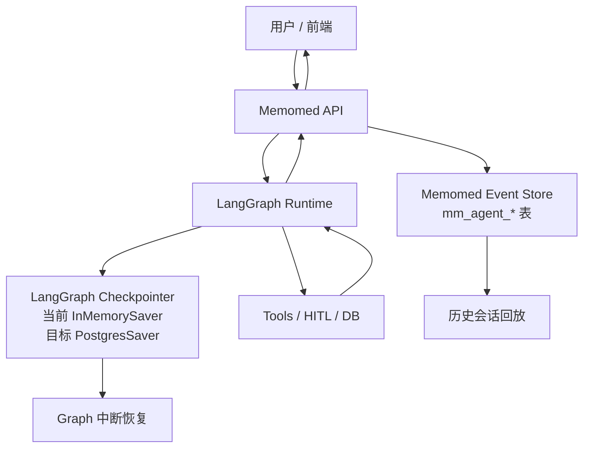

# Memomed Agent Event Protocol 与历史会话技术设计

日期：2026-05-17

最近校准：2026-05-25。本文保留最初设计背景，但“当前实现”以 2026-05-25 代码为准：实时 SSE 和最终 `run_result.events` 已经共用同一份 `AgentEvent` emitter buffer；旧的 `process_events` state/API 中间层已经删除。

## 背景

当前 Memomed 已经跑通了最小 Agent Loop：

```text
用户输入
→ LLM 判断是否调用工具
→ Tool 执行
→ Tool 可能触发 HITL
→ 用户选择/输入后继续
→ LLM 生成最终回复
```

但实际测试中暴露了几个产品级问题：

- 前端过程消息是普通 HTTP 返回后 append，容易把上一轮已有过程重复追加出来。
- Agent 过程和最终回答没有稳定的事件 ID，前端无法准确去重、更新、折叠展示。
- 当前会话没有产品层历史记录模型，刷新页面或重新进入时无法恢复完整聊天时间线。
- LangGraph checkpoint 可以恢复执行状态，但不适合直接作为产品聊天历史的唯一事实源。
- 错误、用户确认、工具结果等中间过程需要像 Codex 一样可见、可折叠、可追踪，而不是只在最终回答里体现。

因此需要定义一套 Memomed 自己的 Agent Event Protocol，把“LangGraph 执行状态”和“用户看到的聊天事件流”分清楚。

## 目标

第一阶段目标：

- 建立标准的 `conversation_id / run_id / event_id / ordinal / seq` 概念。
- 支持历史会话展示和继续上次会话。
- 支持 Agent 过程折叠展示，过程事件不重复、不丢失、不含糊。
- 支持 HITL interrupt，包括选择题、确认、文本输入、未来的报告 OCR 审核。
- 后端以 SSE streaming 为主要实时路径，普通 HTTP 仍返回最终 `AgentRunResult`，但非流式路径不再承载完整过程事件。
- LangGraph 使用官方 persistence/checkpointer 负责执行恢复，Memomed 自建事件表负责产品历史。

非目标：

- 第一阶段不做复杂多 Agent 分支会话。
- 第一阶段不把 LangGraph checkpoint 直接暴露给前端。
- 第一阶段不做完整审计系统，但事件模型要为审计预留字段。

## 核心结论

Memomed 第一版建议：

```text
conversation_id == LangGraph thread_id
```

也就是说，一个前端聊天会话对应一个 LangGraph checkpoint thread。

但概念上仍然要区分：

| 概念 | 所属层 | 作用 |
| --- | --- | --- |
| `conversation_id` | Memomed 产品层 | 用户看到的一段聊天会话，用于历史列表、标题、归档、权限控制。 |
| `thread_id` | LangGraph 执行层 | LangGraph checkpoint 命名空间，用于恢复 graph state、HITL interrupt、time travel。 |
| `run_id` | Memomed + LangGraph 调用层 | 一次用户输入或一次 resume 触发的执行过程。 |
| `turn_id` | Memomed 产品层 | 一次用户原始任务，可跨多次 interrupt/resume。 |
| `work_item_id` | Memomed 展示层 | 一个可折叠的 Agent 工作单元，类似 Codex 的 typed item。 |
| `work_item_type` | Memomed 展示层 | 工作单元类型，例如 `subject_resolution`、`report_ingestion`、`evidence_retrieval`。 |
| `event_id` | Memomed 事件层 | 前端去重、更新、折叠展示的稳定事件 ID。 |
| `ordinal` | Memomed run 内顺序 | 一次 run 内的 1-based 连续顺序。实时 SSE 先用它排序。 |
| `seq` | Memomed 会话内顺序 | 落库后分配的同一 conversation 内严格递增顺序，历史回放用它排序。实时事件在落库前 `seq=null`。 |

当前阶段可以让：

```text
thread_id = conversation_id
```

未来如果一个产品会话里拆出多个独立 graph，例如聊天 graph 和后台报告入库 graph，再引入：

```text
conversation_id = conv_001
thread_id = conv_001_chat
thread_id = conv_001_report_ingestion_001
```

## 为什么不能只依赖 LangGraph Checkpoint

LangGraph checkpoint 的职责是保存 graph state，例如：

- `messages`
- 当前 node
- pending interrupt
- 工具调用结果
- graph 中间状态

它非常适合做：

- 中断恢复。
- 短期上下文记忆。
- time travel 调试。
- 故障后继续执行。

但产品聊天 UI 还需要：

- 会话标题。
- 用户看到的最终消息。
- 可折叠的过程卡片。
- 每个事件的展示状态。
- 错误事件和后续用户输入事件的连续展示。
- 历史列表分页。
- 前端刷新后稳定重放。
- 未来多端同步。

这些不应该强行从 checkpoint 里解析出来。因此建议：

```text
LangGraph Checkpointer = 执行状态事实源
Memomed Event Store = 产品时间线事实源
```

## 总体架构



关键原则：

- 前端只消费 Memomed Event Protocol，不直接消费 LangGraph checkpoint。
- LangGraph 的 `thread_id` 使用 `conversation_id`。
- 每次用户发送消息或完成 interrupt 都创建一个新的 `run_id`，当前实现为 `run_{uuid4().hex}`，不靠 UUID 字符串排序。
- `run_id` 是执行边界，`work_item_id` 是本次执行内的 UI 折叠边界。
- 后端把 LangGraph `custom/messages/updates` stream chunk 转换成 Memomed 标准 `AgentEvent`。
- 实时发给前端的结构事件和最终 `run_result.events` 里的结构事件来自同一个 `AgentEventStreamBuffer`，不是实时一套、最终再从 state 重建一套。
- 前端按 `event_id` upsert；有 `seq` 时按 `seq` 排序，没有 `seq` 的实时事件按 `ordinal` 排序；不按纯文本 append 或内容去重。
- 前端按 `work_item_id` 聚合过程卡片，不按标题、文本或 `run_id` 粗暴合并。

### `work_item_id` 当前生成规则

当前实现里，`work_item_id` 不是由标题或文本决定，而是由“会话 + run + 工作类型”稳定生成。

实时 SSE 事件和最终 `run_result.events` 复用同一批结构事件，因此使用同一条规则：

```python
work_item_id = stable_token("wi", thread_id, run_id, work_item_type)
```

因此规则是：

```text
同一个 run_id + 同一个 work_item_type => 同一个 work_item_id
不同 run_id 或不同 work_item_type => 不同 work_item_id
```

`work_item_type` 来自工具注册表中的 `ToolSpec.capability`：

```text
resolve_patient_tool      -> subject_resolution   -> 确认健康档案对象
query_health_records_tool -> health_records_query -> 查询健康报告
```

前端只按 `work_item_id` 聚合过程卡片，不按标题、文本或 `run_id` 粗暴合并。

### 为什么 resume 后会出现新的同名过程卡

一次用户请求可能跨越多个执行 run：

```text
Run 1：用户说“看看笨笨”
→ LLM 调用 resolve_patient_tool
→ 工具需要用户确认
→ 产生 subject_resolution work item：需要确认本次健康档案的管理对象

Run 2：用户选择“笨笨（宠物）”
→ resume 触发 continuation handler
→ 确认对象成功
→ 产生新的 subject_resolution work item：已确认这次管理对象是笨笨

Run 2 后续：
→ LLM 继续调用 query_health_records_tool
→ 产生 health_records_query work item：报告查询工具尚未接入
```

所以页面上可能出现：

```text
确认健康档案对象：需要确认对象
确认健康档案对象：已确认对象是笨笨
查询健康报告：报告查询工具尚未接入
```

前两个标题相同，是因为它们属于同一个 `work_item_type=subject_resolution`；但它们的执行阶段不同、`work_item_id` 不同，因此当前设计故意展示为两张卡。

如果未来希望把 interrupt 前后的对象确认合并成同一张卡，需要显式引入跨 run 的 work item scope，例如 pending action id 或 user turn id。这个改动会影响前端历史回放、事件顺序、pending interrupt 完成态，不能只在 UI 层按标题合并。

## 数据模型建议

### `mm_agent_conversations`

产品会话表。

```text
id UUID primary key
owner_user_id varchar(64) not null default 'default'
title varchar(200) nullable
status varchar(20) not null default 'active'
langgraph_thread_id varchar(100) not null
last_event_seq bigint not null default 0
created_at timestamptz not null
updated_at timestamptz not null
archived_at timestamptz nullable
```

字段说明：

| 字段 | 含义 |
| --- | --- |
| `id` | Memomed 产品会话 ID。第一版也作为 LangGraph `thread_id` 使用。 |
| `owner_user_id` | 会话所属用户。第一版固定 `default`，未来支持多账号。 |
| `title` | 会话标题，可由首条用户消息或 LLM 总结生成。 |
| `status` | `active` / `archived`。 |
| `langgraph_thread_id` | 实际传给 LangGraph config 的 `thread_id`。第一版等于 `id`。 |
| `last_event_seq` | 当前会话最后一个事件序号，用于生成下一个 `seq`。 |
| `created_at` | 创建时间。 |
| `updated_at` | 最近更新时间。 |
| `archived_at` | 归档时间。 |

### `mm_agent_runs`

一次执行表。用户发送一条消息、用户点击一个确认按钮、用户输入一个 HITL 文本，都应该生成一个 run。

```text
id UUID primary key
conversation_id UUID not null references mm_agent_conversations(id)
owner_user_id varchar(64) not null default 'default'
trigger_type varchar(30) not null
status varchar(30) not null default 'running'
langgraph_run_id varchar(100) nullable
started_at timestamptz not null
ended_at timestamptz nullable
error text nullable
metadata jsonb not null default '{}'
```

字段说明：

| 字段 | 含义 |
| --- | --- |
| `id` | Memomed run ID。 |
| `conversation_id` | 所属产品会话。 |
| `owner_user_id` | 所属用户。 |
| `trigger_type` | `user_message` / `resume_interrupt` / `background_job`。 |
| `status` | `running` / `completed` / `interrupted` / `failed` / `cancelled`。 |
| `langgraph_run_id` | 如果接入 LangGraph Server/CLI 或自定义 run tracing，可存外部 run ID。 |
| `started_at` | 执行开始时间。 |
| `ended_at` | 执行结束时间。 |
| `error` | 失败原因。 |
| `metadata` | 模型、图版本、LangSmith trace 链接等扩展信息。 |

### `mm_agent_events`

产品事件表。前端历史和实时展示都以这张表为准。

```text
id UUID primary key
conversation_id UUID not null references mm_agent_conversations(id)
run_id UUID nullable references mm_agent_runs(id)
owner_user_id varchar(64) not null default 'default'
turn_id varchar(100) nullable
work_item_id varchar(100) nullable
work_item_type varchar(60) nullable
seq bigint not null
event_type varchar(40) not null
role varchar(20) nullable
visibility varchar(20) not null default 'visible'
status varchar(20) not null default 'completed'
parent_event_id UUID nullable
dedupe_key varchar(200) nullable
title varchar(200) nullable
content text nullable
payload jsonb not null default '{}'
created_at timestamptz not null
updated_at timestamptz not null
```

注意：数据库表没有独立 `ordinal` 列。当前实现把 run 内 `ordinal` 写入 `payload.ordinal`，从历史回放读出时再还原到 `AgentEvent.ordinal`。原因是：

- `ordinal` 是 run 内顺序，只用于实时阶段和调试。
- `seq` 是 conversation 内顺序，是历史回放和数据库唯一约束的排序事实源。
- 落库时 `assign_conversation_seq()` 要求 `ordinal` 必须是从 1 开始连续的列表，然后按当前 conversation 的 `last_event_seq` 分配 `seq`。

字段说明：

| 字段 | 含义 |
| --- | --- |
| `id` | 稳定事件 ID，前端用它 upsert。 |
| `conversation_id` | 所属会话。 |
| `run_id` | 哪次执行产生的事件。历史导入或系统事件可为空。 |
| `owner_user_id` | 所属用户。 |
| `turn_id` | 所属用户任务。第一版可为空或由 runtime 生成，后续用于串起一次用户原始请求。 |
| `work_item_id` | 所属可折叠工作单元。前端按它聚合 Agent 过程卡片。 |
| `work_item_type` | 工作单元类型，例如 `subject_resolution`、`report_ingestion`、`health_answering`。 |
| `seq` | 会话内严格递增序号，前端按它排序。 |
| `event_type` | 事件类型，见下文。 |
| `role` | `user` / `assistant` / `tool` / `system`。 |
| `visibility` | `visible` / `collapsed` / `debug` / `hidden`。 |
| `status` | `pending` / `streaming` / `completed` / `failed`。 |
| `parent_event_id` | 子事件所属父事件，例如多个 tool step 归到一个 Agent 过程卡片下。 |
| `dedupe_key` | 同一 run 内幂等去重 key，例如 `thinking:resolve_subject:start`。 |
| `title` | 前端展示标题。 |
| `content` | 前端展示正文。 |
| `payload` | 结构化数据，例如 tool name、interrupt options、错误 code。 |
| `created_at` | 创建时间。 |
| `updated_at` | 最近更新时间。 |

建议唯一约束：

```text
unique(conversation_id, seq)
unique(run_id, dedupe_key) where dedupe_key is not null
```

当前实现里，`event_id` 不再由内容生成，而是主要由 `run_id + ordinal` 生成：

```python
event_id = f"evt_{run_id}_{ordinal:04d}"
```

这意味着两次相同用户文本、两次相同工具结果、两次相同最终回答都会得到不同事件 ID，不会互相覆盖。`dedupe_key` 不是内容级去重机制，不能用来吞掉“文本相同但真实发生了两次”的事件。

`seq` 分配在数据库事务内完成：

1. 对 `conversation_id` 获取 Postgres transaction advisory lock。
2. 查询已有 `mm_agent_conversations` 行并 `FOR UPDATE`。
3. 用已有 `last_event_seq` 作为 offset，把本 run 的连续 `ordinal` 映射为会话级 `seq`。
4. 写入 conversation、run、events 并更新 `last_event_seq`。

这样可以避免同一会话多 tab / 重试 / 并发 run 同时读取到相同 `last_event_seq` 后分配出重复 `seq`。

## Work Item 设计

参考 Codex 的交互思想，Memomed 的折叠块不应该按 tool 粒度，也不应该简单按 turn 粒度，而应该按“用户可理解的 typed work item”聚合。

```text
conversation_id：整段聊天
turn_id：用户一次原始任务
run_id：一次后端执行，包括 interrupt resume
work_item_id：一个可折叠 Agent 工作单元
work_item_type：工作单元类型
event_id：具体事件
```

`run_id` 是执行边界，`work_item_id` 是展示边界。

例如用户说：

```text
帮我存最近报告
```

可能对应：

```text
work_item: subject_resolution / 确认健康档案对象
- resolve_patient_tool
- interrupt.requested
- 用户选择爸爸
- commit_patient_selection

work_item: report_ingestion / 处理报告文件
- 接收文件
- OCR
- 提取结构化字段

work_item: user_review / 入库前审核
- 展示草稿
- 等待用户确认
- 写库
```

一个 work item 可以包含多个 tool，但默认只属于一次 run：

```text
Run 1：识别对象不确定，发出 interrupt.requested，对应一个 subject_resolution work item
Run 2：用户选择后 resume，继续确认对象，对应一个新的 subject_resolution work item
Run 3：用户又发起新的报告查询，再创建新的 subject_resolution work item
```

这样更接近 Codex/ChatGPT 的过程块体验：过程块是“本次回复/本次执行”的中间过程，不是整段会话里永久续写的容器。跨 run 的业务关联可以放在 `payload.pending_action_id`、标题或后续审计字段里表达，不应该让前端把不同 run 的过程折叠到同一个 UI 卡片中。

第一版先落地以下类型：

| work_item_type | 展示标题 | 说明 |
| --- | --- | --- |
| `subject_resolution` | 确认健康档案对象 | 识别本轮要管理的人或宠物，可跨选择/输入 interrupt。 |
| `report_ingestion` | 处理报告文件 | 后续上传、OCR、报告抽取会用。 |
| `user_review` | 等待用户审核 | 后续 OCR/入库前确认会用。 |
| `evidence_retrieval` | 检索健康资料 | 后续问答检索报告、用药、提醒时使用。 |
| `general_tool_work` | Agent 过程 | 暂时无法归类的工具工作。 |

## Event Type 设计

第一版事件类型建议保持少而稳定。

| event_type | 用途 | 前端展示 |
| --- | --- | --- |
| `message.user` | 用户消息 | 普通用户气泡 |
| `message.assistant.delta` | 助手回复增量 | 流式更新助手气泡 |
| `message.assistant.cancelled` | 已下发的临时助手 delta 被工具调用取消 | hidden，不展示为最终气泡 |
| `message.assistant.completed` | 助手最终回复完成 | 固化助手气泡 |
| `run.elapsed` | 当前用户回合已处理时间 | 折叠/状态行，HITL 等待期间继续增长 |
| `process.group.started` | Agent 过程组开始 | 创建折叠过程卡片 |
| `process.step` | 思考、计划、工具调用、工具结果、错误 | 放入过程卡片，默认折叠；具体类型在 `payload.step_type` |
| `interrupt.requested` | 需要用户选择/确认/输入 | 显示交互卡片 |
| `interrupt.resumed` | 用户已完成 interrupt | 过程卡片内部 |

第一版不建议让工具自由输出任意 UI 文案。工具应该输出结构化结果，runtime 再映射成标准事件。

当前代码没有单独落库 `tool.call.started/completed/failed` event type。工具过程统一表达为：

```text
event_type = process.step
payload.step_type = tool.started | tool.observation | tool.error | runtime.note | agent.progress
```

前端只展示白名单步骤，例如 `agent.progress`、`tool.started`、`tool.observation`、`tool.error`；`runtime.note` 默认作为内部过程隐藏或折叠处理，避免把 runtime 过渡文案当作用户正文。

## 事件 Payload 示例

### 用户消息

实时 SSE 阶段 `seq` 为 `null`，最终 `run_result` 落库后同一个事件会带上会话级 `seq`。下例展示落库后的形态。

```json
{
  "id": "evt_run_abc_0001",
  "conversation_id": "conv_001",
  "run_id": "run_abc",
  "ordinal": 1,
  "seq": 1,
  "event_type": "message.user",
  "role": "user",
  "visibility": "visible",
  "status": "completed",
  "content": "帮我爷爷存一下报告",
  "payload": {}
}
```

### Agent 过程组

```json
{
  "id": "evt_run_abc_0003",
  "conversation_id": "conv_001",
  "run_id": "run_abc",
  "work_item_id": "wi_subject_resolution",
  "work_item_type": "subject_resolution",
  "ordinal": 3,
  "seq": 3,
  "event_type": "process.group.started",
  "role": "assistant",
  "visibility": "collapsed",
  "status": "streaming",
  "title": "Agent 过程",
  "content": "正在确认健康档案对象",
  "payload": {
    "default_expanded": false
  }
}
```

### 助手回复增量

`message.assistant.delta` 使用真正的增量语义：`content` 只包含本次新增的 token/chunk，不是累计后的完整文本。

```json
{
  "id": "evt_7c7f_delta_1",
  "conversation_id": "conv_001",
  "run_id": "run_abc",
  "ordinal": 8,
  "seq": null,
  "event_type": "message.assistant.delta",
  "role": "assistant",
  "visibility": "visible",
  "status": "streaming",
  "content": "你",
  "payload": {
    "message_id": "msg_001",
    "delta": true,
    "delta_index": 1,
    "offset": 1
  }
}
```

下一条 delta：

```json
{
  "event_type": "message.assistant.delta",
  "content": "好",
  "payload": {
    "message_id": "msg_001",
    "delta_index": 2,
    "offset": 2
  }
}
```

前端规则：

- 同一 `message_id` 的 delta 拼接成一条 streaming 助手气泡。
- `delta_index` 用于同一条消息内部排序和去重。
- `message.assistant.delta` 必须携带 `payload.message_id` 和 `payload.delta_index`；缺失时前端应直接报协议错误，不允许用 `run_id`、`event_id`、`seq` 或 `ordinal` 兜底猜测。
- `ordinal` 用于实时阶段的 run 内顺序，`seq` 只有落库后才有。
- `message.assistant.completed.content` 是最终权威完整文本，历史回放优先展示 completed，不需要重放 delta。

### 工具调用

当前实现用 `process.step + payload.step_type` 表达工具调用，而不是 `tool.call.*` event type。

```json
{
  "id": "evt_run_abc_0004",
  "conversation_id": "conv_001",
  "run_id": "run_abc",
  "work_item_id": "wi_subject_resolution",
  "work_item_type": "subject_resolution",
  "ordinal": 4,
  "seq": 4,
  "event_type": "process.step",
  "role": "assistant",
  "visibility": "collapsed",
  "parent_event_id": "evt_run_abc_0003",
  "title": "工具调用",
  "content": "正在调用工具：确认健康档案对象。",
  "payload": {
    "step_type": "tool.started",
    "tool_name": "resolve_patient_tool",
    "phase": "started"
  }
}
```

### Interrupt

```json
{
  "id": "evt_run_abc_0009",
  "conversation_id": "conv_001",
  "run_id": "run_abc",
  "work_item_id": "wi_subject_resolution",
  "work_item_type": "subject_resolution",
  "ordinal": 9,
  "seq": 9,
  "event_type": "interrupt.requested",
  "role": "assistant",
  "visibility": "visible",
  "status": "pending",
  "title": "需要确认健康档案对象",
  "content": "请选择这次要管理谁或哪只宠物的健康档案。",
  "payload": {
    "interaction": {
      "type": "select_one",
      "options": [
        {"label": "爷爷", "value": "subject_001"},
        {"label": "新建人物", "value": "create_human"}
      ]
    },
    "pending_action_id": "pa_001",
    "continuation_tool": "commit_patient_selection"
  }
}
```

### 错误后继续请求用户输入

```json
[
  {
    "event_type": "process.step",
    "content": "新建档案失败：该别名已经被其他成员或宠物使用。",
    "payload": {
      "step_type": "tool.error",
      "error_code": "DUPLICATE_ALIAS",
      "tool_name": "commit_patient_selection"
    }
  },
  {
    "event_type": "interrupt.requested",
    "content": "请换一个展示名称，或去成员管理页确认已有成员。",
    "payload": {
      "interaction": {
        "type": "text_input",
        "placeholder": "例如：外公、爷爷A"
      }
    }
  }
]
```

注意：这两个事件都必须保留，不能只返回最后一个。否则前端会丢掉“为什么又让我输入”的原因。

## 前端展示规则

前端不要再简单：

```text
setEvents([...old, ...new])
```

而应该使用 event reducer：

```text
收到 event
→ 如果 event_id 已存在，则更新原事件
→ 如果 event_id 不存在，则插入
→ 有 seq 的历史/最终事件按 seq 排序
→ seq 为 null 的实时事件按 ordinal 排序
→ 根据 work_item_id 组织过程组
```

展示建议：

- `message.user` 显示为用户气泡。
- `message.assistant.*` 显示为助手气泡，delta 期间流式更新。
- `process.group.started` 显示为“Agent 过程”折叠卡片。
- `process.step` 默认放在折叠卡片内部，具体展示由 `payload.step_type` 决定。
- 多个 `process.group.started` 如果拥有同一个 `work_item_id`，前端只展示一个折叠块。
- `payload.step_type=tool.error` 即使在折叠卡片内，也要在卡片摘要中体现。
- `interrupt.requested` 显示为显式交互卡片，不要藏在过程卡片里。
- 历史会话回放时，默认折叠过程卡片，只展示最终用户消息、助手回复和未完成 interrupt。
- optimistic UI 只在渲染层临时合成，不写入真实 `events` 数组，不参与 event timeline 的去重和排序。

### 前端事件层已完成优化项

截至 2026-05-26，前端事件层与本文协议保持以下约束：

| 优化项 | 当前状态 | 文档/代码约束 |
| --- | --- | --- |
| 清理 process.step 内容级 dedupe | 已完成 | 相同文本但不同 `event.id` 的 `process.step` 必须保留；不能用文本去重掩盖重复真实事件。 |
| 清理 final 过程组按 `work_item_type` 误删 streaming 过程组 | 已完成 | 过程块只按 `work_item_id` 聚合；不同 `work_item_id` 即使同标题、同 `work_item_type` 也不能互相删除。 |
| optimistic UI 不再伪造小数 `seq` | 已完成 | optimistic 事件只在渲染层由 `optimisticTimelineUi.ts` 合成，`seq=null`，不写入真实 timeline。 |
| 排序语义集中 | 已完成 | 排序 helper 在 `agentEventOrder.ts`；历史/最终事件按 `seq`，实时未落库事件按 `ordinal`。 |
| delta 协议字段不兜底 | 已完成 | `message.assistant.delta` 缺 `payload.message_id` 或 `payload.delta_index` 时是协议错误，前端不能猜。 |
| 替换 `InMemorySaver` | 未完成 | 这是已知延后项；当前仍为 `InMemorySaver`，跨进程恢复 HITL 需要后续替换为 `PostgresSaver` 或等价持久化 checkpointer。 |

## 后端 API 设计

### 创建会话

```http
POST /api/agent/conversations
```

响应：

```json
{
  "conversation_id": "conv_001",
  "title": null,
  "created_at": "2026-05-17T10:00:00+08:00"
}
```

### 会话列表

```http
GET /api/agent/conversations
```

用于左侧历史列表。

### 会话事件回放

```http
GET /api/agent/conversations/{conversation_id}/events
```

支持分页：

```text
?after_seq=0&limit=100
```

响应：

```json
{
  "conversation_id": "conv_001",
  "events": [],
  "has_more": false
}
```

### 发送消息并流式执行

```http
POST /api/agent/conversations/{conversation_id}/runs/stream
```

请求：

```json
{
  "message": "帮我爷爷存一下报告",
  "attachments": []
}
```

响应建议使用 SSE：

```text
event: agent_event
data: {"id":"evt_run_abc_0001","ordinal":1,"seq":null,"event_type":"message.user",...}

event: agent_event
data: {"id":"evt_run_abc_0003","ordinal":3,"seq":null,"event_type":"process.group.started",...}

event: agent_event
data: {"id":"evt_run_abc_0009","ordinal":9,"seq":null,"event_type":"interrupt.requested",...}
```

随后同一个 SSE 连接会返回：

```text
event: run_result
data: {"events":[{"id":"evt_run_abc_0001","ordinal":1,"seq":101,...}, ...]}

event: done
data: {"thread_id":"conv_001","status":"interrupted"}
```

重要：路由层不再给实时事件做 `seq offset`。实时 `agent_event.seq` 保持 `null`；落库后的 `run_result.events[*].seq` 由数据库事务分配。前端通过同 ID upsert，把实时事件更新成带 `seq` 的最终事件。

### 恢复 interrupt

```http
POST /api/agent/conversations/{conversation_id}/runs/resume/stream
```

请求：

```json
{
  "pending_action_id": "pa_001",
  "decision": {
    "type": "select_one",
    "value": "create_human"
  }
}
```

后端使用同一个 `conversation_id` 作为 LangGraph `thread_id`，并用 `Command(resume=...)` 恢复 graph。

## LangGraph 集成方式

调用 LangGraph 时：

```python
config = {
    "configurable": {
        "thread_id": str(conversation_id)
    }
}
```

新消息：

```python
graph.astream(
    {"messages": [HumanMessage(content=user_text)]},
    config=config,
    stream_mode=["updates", "messages", "custom"],
)
```

恢复 interrupt：

```python
graph.astream(
    Command(resume=decision_payload),
    config=config,
    stream_mode=["updates", "messages", "custom"],
)
```

生产环境 checkpointer：

```text
PostgresSaver
```

当前代码仍使用：

```text
InMemorySaver
```

这意味着产品事件表可以恢复 UI 历史，但 backend 进程重启后，LangGraph pending interrupt 的执行状态仍可能丢失。`InMemorySaver` 是已知待替换项，暂时按“最后替换”处理；只要要求跨进程/重启后继续 interrupt，就必须升级到 `PostgresSaver` 或等价持久化 checkpointer。

### 当前事件生成链路

当前实现的核心是“纯 AgentEvent emitter”方向：

```text
stream_start_chat / stream_resume_chat
→ 创建 run_id 和 AgentEventEmitter
→ 立即 emit message.user、run.elapsed、初始 agent_progress
→ LangGraph astream(custom/messages/updates)
→ custom: 工具/节点内部过程事件，经 emitter 转成 AgentEvent 并放入 AgentEventStreamBuffer
→ messages: 助手 delta，仅实时展示，不进入最终历史
→ updates: graph state 只用于判断 interrupt / final_answer，不再读取 process_events
→ final _to_run_result(... emitted_events=buffer.events())
→ persist_run_result 分配 seq 并落库
→ SSE run_result 返回同 ID、带 seq 的最终事件
```

已经删除的旧逻辑：

- `AgentState.process_events`
- `AgentRunResult.process_events`
- 从 graph state 里的 `process_events` 重建最终过程卡片
- 路由层读取 `last_event_seq` 给实时 SSE 做 offset
- 前端按内容 dedupe 过程事件

graph 内部 `_emit_process_step()` 仍然写 LangGraph custom stream dict，这是 LangGraph 与 runtime 的边界格式；它不进入 AgentState，也不作为 API 字段暴露。真正对外的产品事件只在 runtime emitter 中生成。

### 结构化 Agent State 与通用 Tool Loop

Memomed 的 graph state 不能只依赖自然语言 `handoff_context`。`handoff_context` 只给 LLM 组织回复使用，不能作为程序控制事实源。

最新实现已经从 `current_subject` 这种对象识别特例，调整为通用工具状态机制：

```json
{
  "agent_context": {
    "subject": {
      "subject_id": "subject_mother",
      "display_name": "妈妈",
      "patient_type": "human"
    }
  },
  "satisfied_capabilities": {
    "subject_resolution": {
      "turn_key": "查一下我妈之前的指标",
      "message": "已确认这次管理对象是妈妈（成员）。",
      "data": {
        "patient": {
          "subject_id": "subject_mother",
          "display_name": "妈妈",
          "patient_type": "human"
        }
      }
    }
  },
  "tool_observations": [
    {
      "tool_name": "query_health_records_tool",
      "capability": "health_records_query",
      "status": "capability_missing",
      "message": "已确认健康档案对象，但报告查询工具尚未接入。",
      "data": {
        "subject_id": "subject_mother",
        "record_type": "physical_exam"
      }
    }
  ],
  "active_tool_turn_key": "查一下我妈之前的指标",
  "active_tool_call_count": 1
}
```

字段含义：

| 字段 | 含义 |
| --- | --- |
| `agent_context` | 当前 run/turn 已确认的结构化业务上下文，例如 `subject`。它是后续工具参数和提示词上下文来源。 |
| `satisfied_capabilities` | 当前用户 turn 内已经完成的能力表，例如 `subject_resolution`。用于避免同一轮重复调用同一个已满足能力。 |
| `satisfied_capabilities.*.turn_key` | 该能力对应的用户消息文本。只有等于最新用户消息时，runtime 才认为“本轮已满足”。 |
| `tool_observations` | 最近工具观察结果。无论成功、失败、`capability_missing`，都应该进入下一轮 LLM 上下文。 |
| `active_tool_turn_key` | 当前连续工具链所属用户消息。用户新发一轮消息后，工具计数应重新开始。 |
| `active_tool_call_count` | 当前连续工具链内的工具调用次数，用于熔断异常工具循环。 |

运行时规则：

- 工具返回 `success` 或 `already_satisfied` 后，可以写入 `satisfied_capabilities[capability]`。
- 对象确认只是 `subject_resolution` 这个 capability 的一种结果，不再是 agent loop 的硬编码特例。
- 同一轮用户消息内，如果 LLM 再次调用已满足能力，runtime 返回 `already_satisfied`，不再次执行真实工具。
- 同一个 thread 的下一轮用户消息可以再次调用相同 capability，因为 `turn_key` 已经不同。
- `tool_observations` 必须保留给下一轮 LLM；不能因为存在 `agent_context.subject` 就删除最新 `ToolMessage`。
- `capability_missing` 不是错误熔断条件，而是正常工具观察结果。LLM 下一步应该基于它输出最终自然语言说明。
- 工具循环熔断只统计当前连续工具链，不扫描整个 thread 历史 tool call，避免 interrupt 前的工具调用污染 resume 后流程。
- 旧 pending interrupt 的 tool trace 可以在 handoff 后精确清理，但不能清理正常完成的工具 observation。

这避免了两个常见错误：

```text
错误 1：
用户选择妈妈
→ 只写 handoff_context：“已确认妈妈”
→ LLM 仍然再次调用 resolve_patient_tool
→ graph 再次进入 interrupt
→ 没有最终助手回复
```

```text
错误 2：
query_health_records_tool 返回 capability_missing
→ runtime 因为已有 subject，把最新 ToolMessage 删掉
→ LLM 看不到“工具尚未接入”
→ LLM 继续尝试调用查询工具
→ 工具轮次熔断后进入 final_answer_missing
```

正确做法是：

```text
用户选择妈妈
→ 写入 agent_context.subject
→ 写入 satisfied_capabilities.subject_resolution
→ LLM 可以基于 subject_id 调用后续工具
→ 后续工具 observation 继续写入 tool_observations
→ LLM 基于最新 observation 输出最终回复
```

## 避免重复过程消息的规则

历史上重复的根因是：后端每次返回一批普通 JSON，前端直接 append；而 process event 没有稳定 ID，也没有区分“历史已有事件”和“本次新增事件”。

当前实现用以下规则避免：

### 后端规则

- 每个事件 ID 由 `run_id + ordinal` 生成，不由内容生成。
- 每个 run 内 `ordinal` 从 1 开始连续递增。
- 实时结构事件进入 `AgentEventStreamBuffer`，最终 result 复用同一批事件 ID。
- 每个 conversation 内落库 `seq` 单调递增，由数据库事务分配。
- 同一 run 内同一用户可理解工作阶段使用同一个 `work_item_id`；不同 run 默认不复用 `work_item_id`。
- API 返回“本次新产生事件”或 SSE 实时事件，不重复返回历史事件。
- 如果返回历史事件，必须通过 `GET /events` 明确回放。

### 前端规则

- 按 `event_id` upsert，不做无脑 append。
- 有 `seq` 按 `seq` 排序；无 `seq` 的实时事件按 `ordinal` 排序。
- 按 `work_item_id` 聚合过程卡片，不把不同 work item 的同类过程合并成一个卡片。
- 同一个 `interrupt.requested` 如果还是 `pending`，只展示一张卡片。
- `status` 从 `streaming` 变成 `completed` 时更新原事件，不新增一个看起来相同的事件。

### 文案规则

- `process.step` 描述过程，避免每一步都说同一句“需要确认对象”。
- `interrupt.requested` 描述用户要做什么。
- `process.step[payload.step_type=tool.observation]` 描述工具做成了什么。
- 最终助手回复只面向用户总结，不重复内部过程流水账。

## 和 Codex 交互体验的对应关系

Memomed 不需要完全复制 Codex 的实现，但可以学习它的体验原则：

```text
用户消息
→ 可折叠过程
   → thinking / tool call / error / result
→ 必要时出现交互卡片
→ 用户处理交互
→ 继续过程
→ 最终回复
```

核心不是“每条过程都展示”，而是：

- 过程可追踪。
- 默认不打扰。
- 出错时可展开定位原因。
- 用户需要参与时明确打断。
- 历史回放时仍能看到当时发生了什么。

## 第一阶段落地计划

### 阶段 1：事件模型和非流式兼容

- 新建 `mm_agent_conversations`、`mm_agent_runs`、`mm_agent_events`。
- 当前 `/chat` 和 `/resume` 仍保留普通 JSON。
- 但返回值改成标准 `events`。
- 前端改成 event reducer，通过 `event_id` 去重。
- 解决重复过程消息。

当前落地状态：

- 已创建 `mm_agent_conversations`、`mm_agent_runs`、`mm_agent_events`，并通过迁移补充 `turn_id`、`work_item_id`、`work_item_type`。
- 已让 `/chat` 和 `/resume` 返回标准 `events`，但非流式路径无法获得 LangGraph custom stream，因此不再承诺完整过程事件；完整过程时间线以 SSE 路径为准。
- 已让同一个 run 内的用户可理解工作阶段通过 `work_item_id` 聚合为一个折叠块；不同 run 的对象确认默认显示为各自独立的“确认健康档案对象”过程。
- 已在 resume 时写入 `interrupt.resumed` 事件，并将旧的 pending `interrupt.requested` 标记为 `completed`，避免历史回放时旧确认卡片再次出现。
- 当前 `work_item_type` 来自 tool registry 的 capability，例如 `subject_resolution`、`health_records_query`；通用 runtime 不再硬编码单个工具的标题映射。

### 阶段 2：SSE streaming

- 新增 `/runs/stream` 和 `/runs/resume/stream`。
- 后端将 LangGraph stream chunk 转换成 Memomed event。
- 前端实时消费 SSE。
- 助手回复支持 delta 流式展示。

当前落地状态：

- 已新增 `POST /api/agent/conversations/{conversation_id}/runs/stream`。
- 已新增 `POST /api/agent/conversations/{conversation_id}/runs/resume/stream`。
- 已定义 SSE 事件名：
  - `agent_event`：单条 Memomed `AgentEvent`。
  - `run_result`：本次执行的最终 `AgentRunResult`，用于同步最终状态和 `interrupt`。
  - `done`：流结束标记。
- 前端已通过 `fetch` + `ReadableStream` 消费 SSE，因为标准 `EventSource` 不支持 POST body。
- 前端收到 `agent_event` 后立即走同一个 reducer：按 `event_id` upsert，实时阶段按 `ordinal` 排序；收到 `run_result` 或历史事件后，用同 ID 回填 `seq` 并按 `seq` 稳定排序。

当前阶段 2 已升级为 LangGraph 真流式：

- streaming endpoint 使用 `graph.astream(..., stream_mode=["updates", "messages", "custom"])`。
- `updates` 只负责累积 graph state、发现 interrupt/final_answer 等状态变化；过程事件不再从 state 的 `process_events` 重建。
- `messages` 负责把最终助手回复转换成 `message.assistant.delta`，支持前端 token/小片段级流式展示。
- `custom` 负责工具或节点内部的即时过程事件，例如“开始调用工具”“工具返回”“正在处理用户确认结果”。
- 后端不再只依赖节点结束后的 `updates`，而是在工具执行内部用 LangGraph `get_stream_writer()` 主动写出过程事件。
- runtime 会把 `custom` 事件立即转成 `process.group.started` / `process.step` 发给前端，同时保证流式下发的 `ordinal` 单调递增。
- streaming runtime 会避免把 `continue_pending_action` 的工具结果提前当成最终助手回复；只有 `final_answer` 节点产出的文本才会形成最终助手消息。
- SSE 响应头包含 `Cache-Control: no-cache` 与 `X-Accel-Buffering: no`，避免代理层把流式事件缓存成批量返回。

重要设计约束：

- 过程事件不是最终回答。`process.step` 进入折叠过程卡片，`message.assistant.delta/completed` 才进入助手气泡。
- 工具内部可以产生多个 `custom` 过程事件，但前端仍按 `work_item_id` 聚合成一个用户可理解的折叠块。
- `run_result` 只是本次执行最终同步包，前端实时渲染不能等它回来后再一次性 append。
- `run_result.events` 不是另一套重新构建的过程历史，而是实时结构事件 buffer 加上用户消息、耗时、最终 assistant message 后的最终结果。
- 如果同一个 `process.group.started` 后续从 `streaming` 更新为 `completed`，前端按同一个 `event_id` upsert，不新增第二个折叠块。
- 实时 SSE、最终 `run_result` 和历史回放必须走同一个前端事件归一化函数。历史加载不能直接绕过 reducer，否则会绕过 `runtime.note` 隐藏、delta 合并、work item 聚合等规则，导致刷新前后展示不一致。

### 前端消息渲染

助手最终回复允许使用 Markdown，但前端必须区分“助手正文”和“Agent 过程”：

- `message.assistant.delta` / `message.assistant.completed` 进入助手气泡，可用 Markdown 渲染。
- `process.group.started` / `process.step` 进入折叠过程卡片，不作为正文 Markdown。
- `interrupt.requested` 进入交互卡片，不作为 Markdown 文本。
- 用户消息保持纯文本展示，避免用户输入被误渲染为 Markdown 或 HTML。

当前前端采用：

```text
react-markdown
remark-gfm
rehype-sanitize
```

设计原因：

- `react-markdown` 适合 React/Vite 聊天气泡内渲染 Markdown。
- `remark-gfm` 支持表格、任务列表、删除线、自动链接，适合健康指标和报告摘要展示。
- `rehype-sanitize` 对 LLM 输出做安全过滤，避免 HTML/XSS 风险。

渲染约束：

- 不使用 `dangerouslySetInnerHTML` 渲染 LLM 输出。
- 不使用 MDX 渲染 LLM 输出，避免组件执行能力过强。
- 链接应默认新窗口打开，并加 `rel="noreferrer"`。
- 表格、代码块、列表需要自定义样式，保证在聊天气泡内可读且不撑破布局。
- 流式输出和历史 completed message 必须使用同一个 Markdown renderer，避免实时与刷新后展示不一致。

### 阶段 3：持久化恢复

- LangGraph checkpointer 从 `InMemorySaver` 升级到 `PostgresSaver`。
- 前端刷新后通过 `GET /events` 恢复时间线。
- 如果存在 pending interrupt，恢复交互卡片。

### 阶段 4：会话列表和归档

- 新增历史会话侧边栏。
- 支持会话标题生成。
- 支持归档会话。
- 支持继续上次会话。

## 推荐最终方向

Memomed 后续应采用：

```text
LangGraph = agent 执行引擎
PostgresSaver = graph state/checkpoint 持久化
mm_agent_events = 产品聊天时间线
SSE = 实时事件传输
React event reducer = 前端稳定展示
```

这个方案既保留 LangGraph 的中断恢复和状态管理能力，又避免把产品 UI 历史绑死在 LangGraph 内部 checkpoint 格式上。

第一版最重要的设计决策是：

```text
conversation_id 等于 thread_id，但不要把 conversation 和 thread 的概念混为一谈。
```

这样现在实现简单，未来扩展到后台报告 graph、分支会话、多租户时也不会推翻已有架构。
